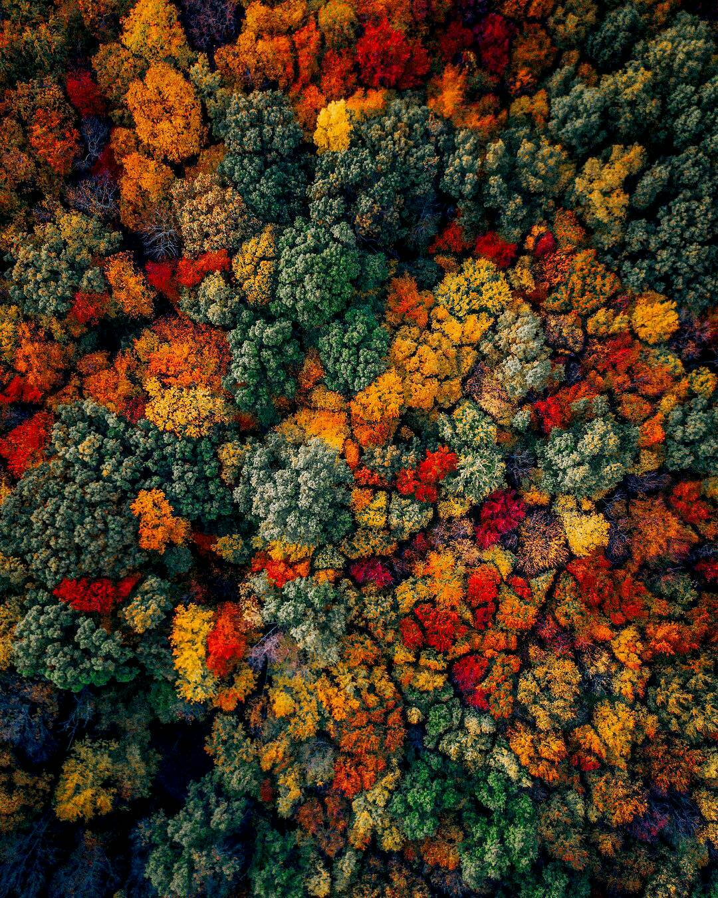
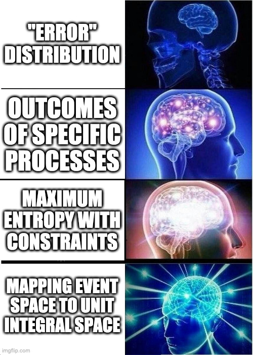

class: title-slide, middle

<style type="text/css">
  .title-slide {
    background-image: url('../assets/img/bg.jpg');
    background-color: #23373B;
    background-size: contain;
    border: 0px;
    background-position: 600px 0;
    line-height: 1;
  }
</style>

# A Field Guide to the Univariate Distributions

<hr width="65%" align="left" size="0.3" color="orange"></hr>

## Introduction

<hr width="65%" align="left" size="0.3" color="orange" style="margin-bottom:40px;" alt="@Martin Sanchez"></hr>

.instructors[
  **Biodiversity Modelling** - Andrew MacDonald
]

</img>

---

<div style='text-align:center;'>
  </img>
</div>
 
---
# Two flavours

--

### Discrete Distributions (integers, counts of things)

Described with a **probability mass function**
--

### Continuous distributions (not integers!)

Described with a **probability density function**

---
## Discrete distributions


$$
0 \leq [z] \leq 1
$$

--

$$
\sum [z] = 1
$$
---
## Continuous Distributions


$$
0 \leq [z]
$$

--

$$
\int_-^+[z]d[z] = 1
$$

---
## Moments

$$
\mu = \text{E}(z) = \sum z[z]
$$

---
$$
\sigma^2 = \text{E}((z-\mu)^2) = \sum (z - \mu)^2[z]
$$

class: inverse, middle, center

---

---

# The Binomial Distribution

<hr width="65%" size="0.3" color="orange" style="margin-top:-20px;"></hr>

---
class: inverse, middle, center

# The Binomial Distribution

<hr width="65%" size="0.3" color="orange" style="margin-top:-20px;"></hr>
---

.pull-left[
```{r binom, fig.show = 'hide'}
curve(dbinom(x,
             size = 20,
             p  = 0.2),
      n = 21,
      type = "p",
      xlim = c(0,20))
```

Probability Mass Function is

$$
\text{Pr}(y = k) = {n \choose k} p^k(1-p)^{n-k}
$$


]
.pull-right[
```{r ref.label = 'binom', echo = FALSE, fig.dim=c(6.5, 9.5)}
```
]

---

.pull-left[
```{r binom2, fig.show = 'hide'}
curve(dbinom(x,
             size = 20,
             p  = 0.2),
      n = 21,
      type = "p",
      xlim = c(0,20))

curve(dbinom(x,
             size = 20,
             p  = 0.8),
      n = 21,
      type = "p",
      col = "red", add = TRUE, pch = 16)


curve(dbinom(x,
             size = 20,
             p  = 0.1),
      n = 21,
      type = "p",
      col = "blue", add = TRUE, pch = 16)
```

Probability Mass Function is

$$
\text{Pr}(y = k) = {n \choose k} p^k(1-p)^{n-k}
$$


]
.pull-right[
```{r ref.label = 'binom2', echo = FALSE, fig.dim=c(6.5, 9.5)}
```
]
