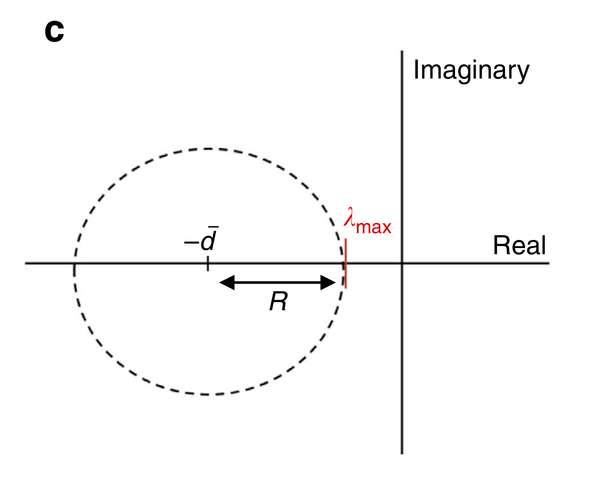
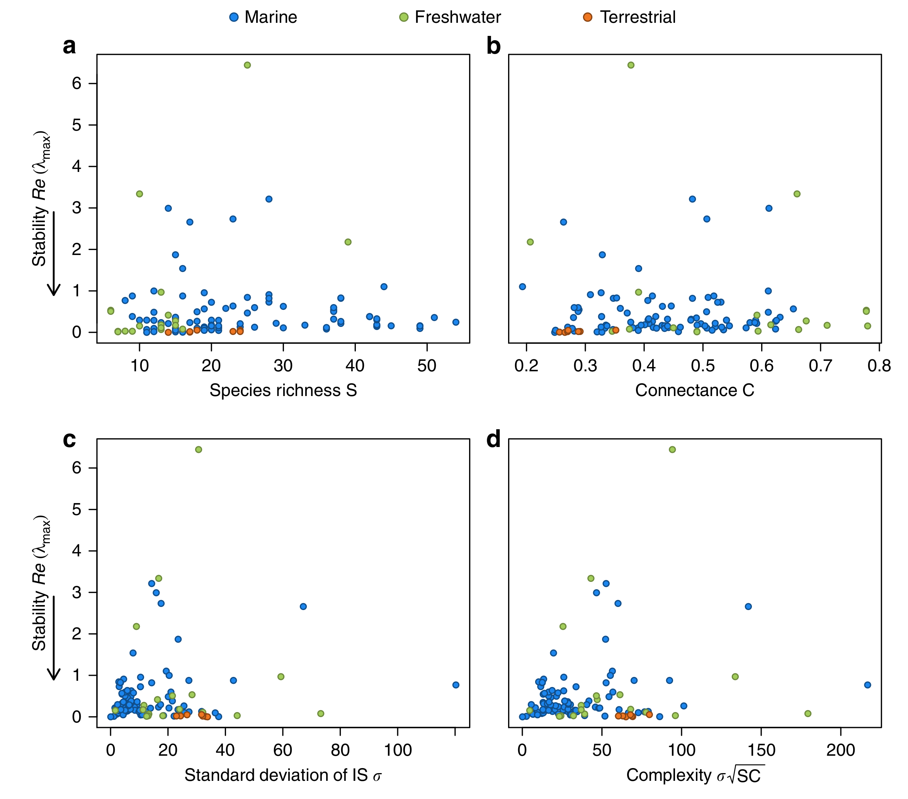
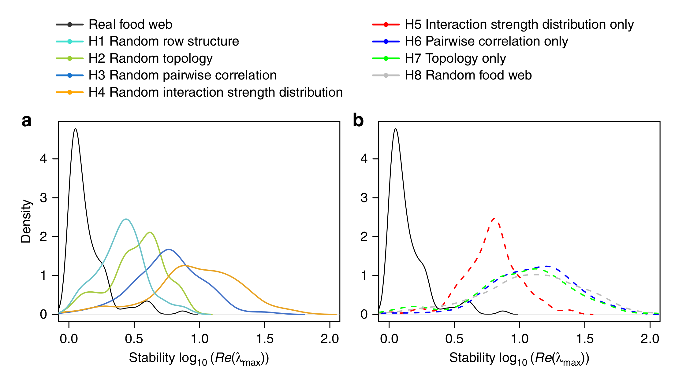

class: title-slide, middle

<style type="text/css">
  .title-slide {
    background-image: url('../assets/img/bg.jpg');
    background-color: #23373B;
    background-size: contain;
    border: 0px;
    background-position: 600px 0;
    line-height: 1;
  }
</style>

# Model evaluation with ecological data

<hr width="65%" align="left" size="0.3" color="orange"></hr>

## Optimization. Problem

<hr width="65%" align="left" size="0.3" color="orange" style="margin-bottom:40px;" alt="@Martin Sanchez"></hr>

.instructors[
  **ECL707/807** - Dominique Gravel
]

</img>

---

# The complexity-stability problem 

In 1972, Robert May proposed a very influential theorem stating that diverse and complex ecosystems (with many links) should no persist because they would be unstable. He derived his proposition with the investigation of the stability of community matrices (Jacobian matrices) describing the per capita effect of each species on the growth rate of other species. Stability is measured by the real part of the leading eigen value of the Jacobian. The smaller is the eigen value is the more stable is the community. Negative eigenvalues are stable while positive eigen values are unstable. 

More specifically, he proposed a boundary to complexity following the inequality :

$$ \sigma \sqrt{SC} < d $$

where $S$ is species richness, $C$ is connectance, $\sigma$ is the standard deviation of a normal distribution of interaction strength and $m$ is the average intra-specific interaction coefficients. 

---

# Complexity-stability in real ecosystems 

<div style='text-align:center;'>
  </img>
</div>

---

# Numerical example

.pull-left[

```{r, eval=FALSE}
# Create a random matrix
S <- 50
C <- 0.1
sigma = 0.5
L <- matrix(0, nr = S, nc = S)
int <- matrix(rnorm(S^2, mean = 0, 
sd = sigma), nr = S, nc = S)
rand <- matrix(runif(S^2,0,1),
nr=S,nc=S)
L[rand<C] = int[rand<C]
```
]

.pull-right[
    
```{r, echo=FALSE}
# Draw the distribution
S <- 50
C <- 0.1
sigma = 0.5
L <- matrix(0, nr = S, nc = S)
int <- matrix(rnorm(S^2, mean = 0, sd = sigma), 
nr = S, nc = S)
rand <- matrix(runif(S^2,0,1),nr=S,nc=S)
L[rand<C] = int[rand<C]
eig_distr <- eigen(L)$values
plot(eig_distr)
abline(h = 0)
abline(v = 0)
```
]

---

# Complexity-stability in real ecosystems 

The problem with May's theory is that the derivation is based on the investigation of random interaction matrices, ie matrices where every species can interact with every other species. That means that all types of interactions are equally feasible and there is a prevalence of asymetric interactions. Real ecosystems are far from random and therefore theoreticians developed several arguments proposing that this organization is promoting stability. 

---

# Complexity-stability in real ecosystems 

<div style='text-align:center;'>
  </img>
</div>

---

# Complexity-stability in real ecosystems 

<div style='text-align:center;'>
  </img>
</div>

---

class: inverse, middle, center

# Problem : is there a way we can arrange links in a matrix that would maximize stability ?

<hr width="65%" size="0.3" color="orange" style="margin-top:-20px;"></hr>

---

# Instructions

1. Write a function to generate a random matrix for pre-specified $S$ and $C$
2. Write a function to compute the real part of the largest eigen value of a matrix $L$
3. Write a function to perform simulated annealing with a matrix $L$ as input and returning an optimized matrix $L_{opt}$ as output
4. Run the optimization procedure for a gradient of species richness and record $L$ and $L_{opt}$
5. Evaluate if the "potential for stability" ($L-L_{opt}$) relates to complexity


