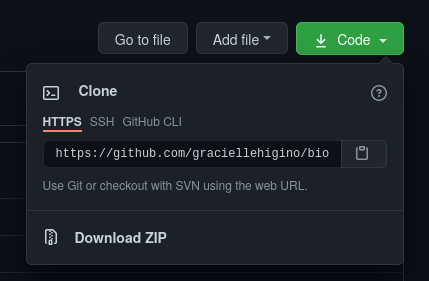

### 🚧 **This is a work in progress!** 🚧  

For participants of the Project Set-Up training, we will use the first 4 days of this guide (Sunday through Wednesday). Please ignore the other ones (although Thursday is really cool!).  

Have fun!  


--- 

Have you ever felt lost in your own projects? Do you feel like your workflow is quite effective, but it's not transparent enough? This detox routine can help you regain control over your (very messy - I know!) project structure and discover a marvelous world of collaboration and contribution in open science!  

Reproducibility is a principle that resonates to the most used concept of science, assuring that a hypothesis is *testable*. It means that the process to test an idea - from data to results - can be repeated. It is different from *replicability*, which means the process can be repeated, but using different data.  

In this detox week we will reflect and experiment with open science, using our skills for project design, version control, virtual environments and automation. We will reevaluate our current workflow and fine-tune where needed, to reach the most reproducible workflow possible for us.

---

# Sunday - reflect about open science

>### **Self-care task of the day**
>Go to a calm place. No need of silence, just a place where you can just be still. Set a timer for 5min. Take a deep breath in, and a deep breath out. Give your body a scan-through: concentrate in each centimeter of it and try to be aware of how does your body feel there. Everytime you find a contracted muscle, try to relax it. Pay attention to the sounds around you. When the timer is off, take another deep breath.

<!-- pagebreak -->

On the first day of this detox journey, let's reflect on our way to work and how it could be better. Take a moment of your day and think about:

1. What is your current workflow when you develop a project? Take a pen and paper (physical or digital) and sketch your usual process, step-by-step. Add as much details as you can (and take this chance to get creative!). Make sure to save this sketch in a place that is easy to access, you're gonna need it in the following days.

2. How do we build trust and facilitate collaboration in our projects?

3. How can be inclusive by design - what can we do in our projects to invite collaboration?

4. Is reproducibility openness? If a project is reproducible, does that mean it is accessible?

## Suggested reading
* [Our path to better science in less time using open data science tools](https://www.nature.com/articles/s41559-017-0160)

---

# Monday - design a project

>### **Self-care task of the day**
>Go to somewhere where you feel in peace or happy. Take paper and something to write - even better if it's colorful! Set a timer for 30 minutes and doodle something that reflects how you are feeling, something that represents a happy thought you had today, or something that represents the place you are right now.

In this step we will squeeze our creativity out of our brains to come up with a project that is **reproducible by design**. Is there a hierarchy between your folders? Which folders do you need? Should you mix raw and clean data? Did this last question offend you?

There are a couple of tools you can use to automatically create a project structure for you, such as RProject and its combination with the R package [`minimaltemplate`](https://kguidonimartins.github.io/minimalTemplate/), or the [`PkgTemplate.jl`](https://github.com/invenia/PkgTemplates.jl/) for development of packages in Julia.

The main things you need to reflect on when designing your open project are:

1. Will I use data? If yes, will I need to treat/clean/subset them?

2. Will I use code?

3. [Will it be shared? If yes, how? Do I want people to cite me, for exemple?](#licenses)

4. Will I need to generate manuscripts/reports/figures?

5. Will it be useful for people to know how to navigate my project? Will I welcome collaborators and contributors?

6. [What is the naming system I will use - for both folders and files?](#give-cool-names)

See an example of a structured project below (adapted from [here](https://kguidonimartins.github.io/minimalTemplate/)):

```
## /home/awesome-manuscript
## ├── .github
## ├── .gitignore
## ├── .travis.yml
## ├── DESCRIPTION
## ├── LICENSE.md
## ├── R
## │   ├── analysis.Rmd
## │   ├── local_functions.R
## │   └── package_list.R
## ├── README.md
## ├── awesome-manuscript.Rproj
## ├── data
## │   ├── clean
## │   ├── raw
## │   └── temp
## ├── main-script.Rmd
## ├── manuscript
## │   └── sources
## │       ├── ecology-letters.csl
## │       ├── library.bib
## │       ├── packages.bib
## │       └── template.docx
## ├── output
## │   ├── figures
## │   ├── results
## │   └── supp
## └── todo.txt
```

Very nice, but the **TL;DR version** is:

* Consider having a dedicated folder for your **data** and  split them into clean and raw data (alternatively, you can store your cleaned data inside an "output" folder, where other sorts of outputs will also be). If needed, create another folder for "sandbox data" - we need to have room for creativity in science! Also make sure to store the metadata in these folders, alongside their respective data, where they belong.

* If you will produce **reports/manuscripts**, maybe it's a good idea to have a dedicated folder for them too. Store there everything you'll need to render your files, such as bibliography and templates.

* **Figures** should go in their own folder too.

* **Code** usually go in their own folder too, but if the code is about making the project work and putting everything together, it should go in the root.

### Give cool names
Your project is so awesome that it needs the coolest names in its folders and files! **Good names are informative and consistent**. It is a hard exercise, but we do get better with time. The main things to think about when naming your things are: 

1. Does it describe what's inside without being verbose?

2. Does it allow for correct ordering?

3. Is it easily searchable (a.k.a., machine readable)? Will my computer crash if I need to change to this directory?

### Licenses

An important part of making your work reproducible by anyone is to share it, and to do that safely, it is important to connect your project to a license. This is a statement about what and how people can use any part of your project.
Chosing a license can be a difficult task at first, but if your projects have a common structure, they should be ok with the same license. When chosing a license, it is important to ask yourself (and your collaborators) the following questions:

1. Do we want people to give us credit for our work when this projects is distributed, derived, performed or displayed?

2. Do we want the derivatives of this project be shared with the same license that we chose?

3. Are we ok with this project being used for commercial purposes?

A combination of your answers will guide you to find the best license for your project which is adequate for your community. There are a couple of online tools that can help you with that! For example, if you are sharing creative work, you can consult the [Creative Commons - Choose a License](https://creativecommons.org/choose/) tool. For other open source software licenses, you can take a look at the [Choose A License](http://choosealicense.com/) website. The cool thing is: you can also **create** your own license! In any case, once you chose the appropriate license for your project, save it in your project root folder with the name "LICENSE" (as a text file). This way, your version control host system will automatically recognize it and display something like "hey, this project has a license!" when someone finds your project.

## Reproducibility task of the day

Take a moment to evaluate your current project design. How would you make it better? If there is something missing (a license, cool names, a good structure), try to implement what you've learned: one simple thing is enough! Pick one project + one improvement and do it \o/
You can start even with pen and paper! Scketch what's the flow of information inside your project right now. Is there any redundancies? Could a path between righly connected directories be shorter? Could the names of the folders be shorter if they were arranged some other way?

Need help? Ask a friend to do it with you!

## Suggested readings

* [Mozilla Open Leaders lesson on sharing your work in the open](https://mozilla.github.io/open-leadership-training-series/articles/get-your-project-online/sharing-your-work-in-the-open/)  

* [How to License Research Data](https://www.dcc.ac.uk/guidance/how-guides/license-research-data)

---

# Tuesday - control your versions

>### **Self-care task of the day**
>YouTube is full of people making their own version of their favorite songs. The self-care task of the day is to pick one song and look for versions of it on YouTube. Maybe start looking for you favorite song. What are the differences between the versions? Which one did you like the most? Have you discovered a cool artist because of this search? If you couldn't find a cool version of your favorite song, take a moment to imagine how your own version would sound like.

## What is version control? Why is it cool to use?


A version control system allows changes made to a file to be recorded in a timeline, and it is possible to retrieve previous versions at any time.  

This is possible because with version control you don't save copies of your work, but its history, avoiding things like this in your working directory:  

```shell
- project/
	|- scripts/
		|- script-v0.1.R
		|- script-after-review-from-Princess-Lea.R  
		|- script-merged.R  
		|- script-not-working-anymore.R  
		|- script-wtf.R  
```

[Git](https://git-scm.com/) is a *distributed version control system*, which means the snapshots of your work are stored in your local drive, but also can be distributed from the cloud to other developers.

## A little bit of Git vocabulary and architecture  

The basic architecture we have to deal with is composed of a branches (including one we'll call "main", but is sometimes called "master"), clones and forks.  
  

### The repository main timeline

The **`main`** is the primary timeline of your **repository** (a project with the files required to develop it). There the files will ideally only be changed when strictly necessary, i.e. when a change is critical to the progress of the project.  

### Branches from the master: branch

A **branch**  is a ramification from any other timeline. It is like a copy repository within the main repository, which is created to test changes that may or may not be implemented in the `main` timeline. Ideally, each developer creates a branch to test the changes they deem necessary and submit these changes to their colleagues' judgment before implementing them in the `main`.  

### Copying repositories from the 'cloud' to the computer (or, working offline):

Repositories can be created online and many things can be done there. However, in order to work locally on a repository, i.e. to work offline, we need to create a **clone** of the repository we have online. A clone is a synchronised copy of your online repository. Everything you do in your local working directory (corresponding to the clone) will be synchronized with the online repository. 

### Copying online repositories

In turn, **forks**  are complete, independent copies of a repository. We use a fork (not a clone) when we want to change the direction of the project, or when we want to contribute to someone else's project independently and only then suggest changes to the original project. If you need to update your fork with the newest version of the project, you can do that by requesting a **fetch** to Git.  

### General workflow vocabulary

When we change some file and save the new version, we do a **commit** . Commits should be accompanied by short but sufficiently descriptive comments, so that you can understand what the difference in that version is and locate it more easily. With commits you can track what change was made, where, by whom and when.  

  

After changing a file and saving the new version, this version needs to be given a tag (an identification code), and then uploaded to the online repository. We call this a **push**. To update your local directory with the newest versions of files, you must tell Git to **pull** them.  

When working on a branch, you can request that the changes you have made be implemented in the main branch of your *workflow* (or any other branch). To do this you request a **merge** via a **pull request** . In a pull request, you ask a repository owner or contributor to accept the changes you made to a fork or branch into another branch. If they accept, you are listed as a contributor to the project.

## Working remotely  

The online portal of your Git server allows you to do most of the tasks described above in a very intuitive way. You can edit some files, upload others, request a merge, create and delete a branch, etc. Once you know the Git logic and architecture, it is easy to work online.    
For a detailed walkthrough, take a look at [this page](https://mozillascience.github.io/WOW-2017/github/).

## Working locally  

However, the changes we need to make cannot always be done directly in the portal, or would be done more efficiently if we worked on our computer, with our preferred software. To work on your repository from your computer, you only need to install Git itself (https://git-scm.com/downloads). Some softwares allow you to visualize the timeline and operations being made, such as GitKraken (https://www.gitkraken.com/) and some extentions for VSCode and RStudio.

Once you've installed Git, the there are two possible ways to start:  

* You can create your online repository directly on your Git host server (such as GitHub, GitLab or Bitbucket);  
  
* Or you can "transform" a local directory into a Git controlled project.  

In the first case, to have a copy of your online repository on your computer, just clone your directory, either by downloading all the files in a .zip or by copying the ssh key or html address to use in a Git command.  



You can also clone from GitKraken, by clicking on the little folder on the top left corner or on "File" on the menu.  
  

In the second case, you must right-click on your workbook and open the Git Bash; alternatively, in GitKraken, you can click on "Init" in the same window shown above and indicate the directory of your workbook in "New repository path".  

## Basic Commands

The following commands will give us an idea of a *workflow* in Git.

To use Git, you need to configure it so that your account on your Git server is recognised by it. In Git Bash: 

```bash
git config --global user.name "username"
git config --global user.email "iamawesome@email.com"
git config --list #Confirm your settings
```
There, now Git knows who you are.  


To start a repository from your computer, you can tell Git to start or "watch" a folder.  
First, check what the working directory is and change it if necessary.  


```bash
pwd # prints the working directory
cd	# takes you to the root
cd .. # takes you to one level up directory
cd "your/directory" # changes your working directory
```


To clone your repository, copy the url as shown in the picture above and ask Git to clone the repository into the directory you indicated.  

```bash
git clone https://github.com/graciellehigino/bios2.github.io.git
```
The above command will create a folder with the same name as the repository in your working directory. If you want the folder created to have another name, include that after the repository address. This process works if you have an online repository and want it to exist on your computer. You can also do it the other way round. If you have not yet created a folder for your project, you can ask Git to create one for you:

```bash
mkdir "web-repo-github"
```

But if you already have a folder and want Git to "watch over" it, start a local repository in the directory indicated:

```bash
git init
```
You can (maybe you need to) tell Git where your remote repository is: 
```bash
git remote add origin https://github.com/graciellehigino/bios2.github.io.git
```
Ok, now your repository is ready to use.  
Check if there are new files in your folder or modified files that haven't been pushed yet:  
```bash
git status
```

Hey, couldn't you find an important file? Add it to the Git vision field now!

```bash
git add file # adds a file

git add -u # updates the file tracking

git add -A # all the above
```
To make additions interactively via the terminal, use:
```bash
git add -i
```

Follow the instructions provided by the terminal and include as many files as you want before committing.  

Now that Git is keeping an eye on all your files, any changes you make (and want them to be recorded in this file's timeline) will be detected. To make sure your changes are recorded, "commit" the changed file with a comment so you can remember what the difference is in that version.

```bash
git commit -m "it's awesome now"
```

A `commit` only updates the local repository if you are working locally, or the remote repository if you are working remotely. To synchronize the two repositories, you must either `push` updates to the remote repository or `pull` updates to the local repository.
```bash
git push origin master
#"Git, please take the updated files to the remote repository 'origin', on the 'main' branch."

git pull
#"Git, please bring the updated files from the remote repository to my local repository"
```
### How to track changes in my files?
Check the changes in the content of the files (e.g. new lines added):
```bash
git diff
```

Check the files and their changes that are in the stage area:
```bash
git diff --staged
```
If you are lost between the different versions of your files, check the commit history! :)
```bash
git log # history of project commits since the beginning
git log -p # detailed historic of commits (i.e. git log + git diff)
```

Depending on the size of the changes, the log may be very large and you will need to press "return" to each page to see all the changes. At the end you will see `(END)`, then press the letter 'q' to finish reading.  
If you only want to check the latest commits, limit the list with `git log -p -1` (replace the 1 with the number of commits you wish to see). You can also check out the entire change history of the working directories with the Git viewer with `gitk`. Isn't that cool!  

### Working with branches  
*Branches* are ramifications of other timelines. They are very useful when you need to test or work on large changes without changing what is on the main branch. It is very important to maintain branches in your collaborative work, because it reduces the chance of the main branch suffering accidental major changes and simplifies the management of file versions.  

```bash
git show-branch -a # lists all branches

git branch name_of_branch # creates a new branch

git checkout name_of_branch # transfers the workspace to the new branch

git checkout -b name_of_branch # creates a branch and transfers the workspace
```
When all the changes you have made to your branch are done and you think it is time to merge them into the `main` (or any other branch), move to the target branch and request a merge:  

```bash
git merge new_branch # merges the changes from 'new_branch' to 'main'
```

If you no longer need the branch and want to delete it, use the `git branch -d new_branch` command.  
It can often happen that your working branch is not up to date with the `main`. This can be a problem if the `main` has important updates for the development of your project on the branch. To bring the `main` updates to your branch, follow these steps:    
1. Check if your workspace is on the `main` branch. If not, transfer it:
```bash
git checkout master
```
2. On the `main`, update your local directory:
```bash
git pull
```   
3. After updating your local directory, move to your branch, merge the `main` updates into your branch and upload to the remote repository:
```bash
git checkout your-branch
git merge main your-branch
git push
```
That's it! Now your branch contains everything that was new in the `main`. :)

## Oh, my Git! D=
Did you mess up commits? Want to revert a change? Don't despair!  
If you made a commit and regret it, but don't even remember which commit it was (["Find out commits associated for a specific file"](http://stackoverflow.com/questions/3701404/list-all-commits-for-a-specific-file)):

```bash
git log -p filename`
```
If you want to include new edits to the last commit, replacing it:
```bash
git commit --amend -m "message"
```

If you want to remove any file from the stage area after a `git add .`:

```bash
git reset HEAD new_file.R
```

But if you want to remove it from your *working tree* and the set of added files:

```bash
git rm new_file.R
```

If all that goes wrong, try the following (tips taken [from here](https://stackoverflow.com/questions/23068790/git-revert-certain-files)):

```bash
git revert --no-commit <commit hash> # Revert, but don't commit yet
git reset # Take everything from the stage area
git add yourFilesToRevert # Add files to revert
git commit -m "commit message"
git reset --hard # Undo changes not commited
```

If you want to remove all local changes and commits, retrieve the most recent history from the server and point to your local branch `main` like this:
```bash
git fetch origin
git reset --hard origin/master
```

That's it! There's ***a lot more*** in the git world, but I hope this guide can help you on your version control journey.  

**Remember**: keep the `main` as untouched as possible, work with branches to test your ideas, and always `push` your modifications before going to bed.

## Reproducibility task of the day
Set up the tracking system in your project! Create a remote repository and connect it with your local directory. If you already use a version control system, review your workflow both when working alone and in collaboration: what are the actions most likely to cause a problem? Can you make it simpler?

>hint: make a colorful and friendly sketch of your current workflow!

## Suggested reading
* This lesson was translated from a git guide in Portuguese I wrote with Karlo Guidoni in a study group we promoted at Universidade Federal de Goiás, back in 2017, and we used time and again in our reproducibility trainings. You can take a look in our repository [here](https://github.com/kguidonimartins/studygroup-ufg).


# Wednesday - make your code and manuscript reproducible
>### **Self-care task of the day**
>What is your favorite food? Do you have a story of a special meal prepared by a loved one? The self-care task of the day is to call someone you love and ask them to explain how to prepare a special meal: one that you really like or one of their favorites. If you're feeling adventurous, try to reproduce it before the next task tomorrow!

## Reproducible code

Today is the day to make your future-self thank you! We will go through some tips and tricks to make your code more friendly, surviving the test of time and of your own memory.

A reproducible code is an essential part of a reproducible project. Having a code to reproduce your analysis is already a great start, congrats for that! :crown:  

Today we'll try to go a step forward and write a love letter for your future-self by adding comments on your code, rethinking about object names, investigate how we can compile chuncks of code inside functions and, finally, think about reproducible manuscripts.
### Style
There are no right or wrong when it comes to style: there are best-practices and what works better for you or your project.

For example, Google has a series of style guides they use to standardize code writing in the company. There is a [Google's R Style Guide](https://google.github.io/styleguide/Rguide.html) and a [tydiverse style guide](https://style.tidyverse.org/) which can be a good inspiration to find your own. Here's an idea: create a document whre you usually store code. List all conventions you use and have never thought about ***why*** you use them and reflect if they still make sense for you. If they do, keep them. If they don't, try to improve them. Is there any other thing you never thought it was important, but it could be? Do you have a convention for function names, for example? 

**Object names**  
Object names are the major source of wasted time for me, especially when the code is already super long with numerous objects. What helps is to know they should be descriptive, yet concise. A good tip is to [name objects as nouns and functions as verbs](https://style.tidyverse.org/syntax.html#object-names).  

>What do you think is important when naming objects in the languages that you use? Take 5 mins to write a list!

### Comment  

Another good practice is to ***always*** comment your code. It will help you understand the decisions you've made throughout this process, that's why a good tip is to write simple comments that state ***why*** you wrote that line of code. What do you think of buying a friend a coffee and ask them to review your code annotation? Maybe you can make some lines clearer while hanging out in a park! 

In a larger scale, it is important to have other kinds of notes: session info (e.g., in `R` you can use the command `sessionInfo()`), package versions (e.g., using the `checkpoint` package), dependencies and connections between code scripts and data files. A good example of documentation is [this README file](https://github.com/BIO6032/2019_replication_HastingsPowell_1991/blob/master/README.md) written by our colleague Gabriel Dansereau: it contains clear instructions of how to use the code, how the respsitory is organized and even notes on possible warnings and what they mean.

It can be complicated to keep track of everything everyday, so here's a tip: schedule a day in your month (or week) to update the documentation of your project! People call it "documentation day" out there, and you'll find lots of blogposts about it online.

### Functions and packages

Functions can help you keep your code cleaner and avoid errors when you repeat actions. They should replace redundancies in your code. In the same way, when you notice you have to repeat a certain routine in many of your projects, it might be worth writing a package - which is basically a set of functions. When you do that, don't forget to include in your functions some commands that check for errors, like when you try to use a type of variable that is not compatible with the analysis that run inside the function.

>Take a few minutes to have a look at your code now. Can you see something that could be a function? 

## Reproducible manuscripts
From reproducible code to reproducible manuscripts is one small leap! It means your manuscript is readable across platforms and systems, and can be compiled locally, and even be automatically updated if your data or analyses change!
It doesn't mean that the interpretation of the results will be automatically updated aswell - which seems to be a concern for some people, that argue that reproducible manuscripts turn the science activity into a mechanic thing. On the contrary: it allows you to not worry about making figures over and over again, and concentrate in the philosophical part of your science!

There are three basic things we need to understand to produce a reproducible academic manuscript: the [YAML](https://yaml.org/), the [markup language](https://en.wikipedia.org/wiki/Markup_language) (such as Markdown) and the citation/references management.

**YAML** (YAML Ain't a Markup Language - metalingustics!) is a language that defines the metadata of your document and helps in the compiling process. It tells your computer if the output you need is a `*.pdf` or a `*.doc` file, for example. A YAML block will be the first thing you'll add on your document, and the only tricky thing is to get the indentation right.

For example, the YAML of this very webpage looks like this:
```yaml
---
title: "(un)Reproducibility Detox"
description: |
  A seven-day detox routine to improve the reproducibility of your projects!
author: Gracielle Higino
preview: thumb.png
categories: 
  - Technical
  - EN
date: 06-13-2021
output:
  distill::distill_article:
    self_contained: false
    toc: true
---
```

You should add to your manuscript a `bibliography` argument with the path to your `*.bib` file and change the output according to your needs. If you use RStudio, these things are easier to change as it has built-in templates with pre-filled YAML header.

Another cool thing to add in your YAML header is a reference to a template. This will make your computer compile your manuscript in the same format as your template - which helps a lot when you submit the manuscript to a journal.

A couple of packages can help you put together all these pieces. The `rticles` package imports LaTeX templates from scientific journals and implements a dialog box in RStudio. The `rmdTemplates` package has also slides, Word and PDF templates. It helps a lot starting with a template and fill in the blanks (also make sure to consult the [**R Markdown Cheat Sheet**](https://www.rstudio.com/wp-content/uploads/2015/02/rmarkdown-cheatsheet.pdf)). This basic syntax is the same used in Markdown and other similar markup languages. For example:

`**this is bold**` -> **this is bold**  
`*this is italic*` -> *this is italic*  

```markdown
|this|is|a|table|
|:---|:---:|---:||
|a|table|this|is|
```

<style type="text/css">
.tg .tg-c3ow{border-color:inherit;text-align:center;vertical-align:top}
.tg .tg-0pky{border-color:inherit;text-align:left;vertical-align:top}
.tg .tg-dvpl{border-color:inherit;text-align:right;vertical-align:top}
</style>
<table class="tg">
<thead>
  <tr>
    <th class="tg-0pky">this</th>
    <th class="tg-c3ow">is</th>
    <th class="tg-dvpl">a</th>
    <th class="tg-0pky">table</th>
  </tr>
</thead>
<tbody>
  <tr>
    <td class="tg-0pky">a</td>
    <td class="tg-c3ow">table</td>
    <td class="tg-dvpl">this</td>
    <td class="tg-0pky">is</td>
  </tr>
</tbody>
</table>

### Citation/reference management

A good idea is to keep an up-to-date text file containing all your bibliography that can be referenced in your manuscript. For example, you can ask your reference manager software to generate a `*.bib` file, which usually contains a specific tag for each citation. This tag will then be used in your file as something like `[@TagPaper]`.  

The citation style, on the other hand, is usually defined by a `*.csl` file (https://citationstyles.org/). These files can be found, for example, on the [Zotero Style Repository](https://www.zotero.org/styles), and all you need to do is download the file and keep in in the same directory as your manuscript.

## Reproducibility task of the day

Can you "transform" one of your manuscripts into a reproducible file? What are the steps you need to take to get there? 

Do you already have all your manuscripts in a reproducible format? Congratulations! Your task will be to help a friend that is learning how to make one!

## Suggested reading

* [Methods in Ecology and Evolution blog post with tips and tricks for reproducible code](https://methodsblog.com/2017/12/06/making-your-code-reproducible/)  

* [BES guide to reproducible code](http://bit.ly/BESGuidesTo)  

* [rOpenSci reproducibility guide](http://ropensci.github.io/reproducibility-guide/sections/writingCode/)  

* [YAML front matter, in the "papaja: Reproducible APA manuscripts with R Markdown"](http://frederikaust.com/papaja_man/r-markdown-components.html#yaml-front-matter)  

* [An R Markdown Template for Academic Manuscripts](http://svmiller.com/blog/2016/02/svm-r-markdown-manuscript/)  

* [Ansible YAML guide](https://docs.ansible.com/ansible/latest/reference_appendices/YAMLSyntax.html#yaml-basics)

* [Markdown syntax in "R Markdown: The Definitive Guide"](https://bookdown.org/yihui/rmarkdown/markdown-syntax.html)


# Thursday - preserve your tools

>### **Self-care task of the day**
> It's time to update all those packages (and maybe even language version) - you deserve to be able to play with the newest toys on the block. While all this is happening in the background put your feet up and hit play on the TV or podcast series you've been meaning to catch up on.

## Why do we need to preserve our tools?

So you've commented, documented, and shared your code meaning that it's ready to be used by the rest of the world, right? Well maybe for now but you know what they say about time - *all hours wound; the last one kills*. Okay that was maybe a bit dramatic but there is of course the problem that as time progresses and langages/packages are updated our code becomes out-dated and (worst case scenario) non-functional. Programming languages (and packages) are continually evolving as developers work at squashing bugs and making performance upgrades and sometimes these upgrades might result in a fundamental change in how the a language or package functions _e.g._ a function name might change or some functionality will be removed in favour of another. This means that in a few years that beautifully documented chunk of code that we've written today might not even run. 

Oh dear...

<center>


</center>

What this boils down to is that we need to not only think about documenting the code itself but also all the 'backend' features that make it tick _i.e._ not only what packages we're using but also what versions. In the bigger scheme of things this should also extend to the version of the langauge you are using and even the OS (operating system) 

Although this may seem daunting it's important to remember that the journey to 
reproducibility is much like how one approaches eating an elephant - we take 
it one bit~~e~~ at a time. So don't be afraid to take a little nibble before biting off more than you can chew.

## How do we _keep_ our work reproducible?

The good news is that there is a lot of functionality out there to help us on our reproducibility journey. Different languages have different ways we can document and 'keep' the package version that we are using. The main focus will be using `R` as it is the current *lingua franca* of most ecologists and it also straddles the middle ground between being very 'picky' like `python` and literally having a built in (although not always perfect) system like `Julia`. 

The big (language agnostic) take home message here though is that it's important to (at minimum) keep record of the versions of things you used if you want your work to work a few months/years down the line. By keeping a record of the package, software and OS versions used we give other users (and our future selves) a chance to recreate the environment that allowed our project/code to run should things change or be updated. 

The three main approaches and packages we will discuss are `{groundhog}`, `{renv}` and, `docker`. There are of course other ways to document package versions but these are (somewhat) user friendly and will give you different 'levels' of reproducibility. It is of course also possible to mix and match these different platforms. SO lets dtart from the bottom and work our way up:

### `{groundhog}`

[`{groundhog}`](http://groundhogr.com/using/) is a relatively new kid on the block - and apparently refers to a film of the same name (no comment on my side as this is a facet of pop culture the eludes me). This is a super easy package to implement (think one function easy) and is a really nice way to 'retrofit' some of your older code.

**How it works:** Essentially `{groundhog}` will install the version of a package that was available on CRAN for a specified date. This is done by 'replacing' the `library("package")` with `groundhog.library("package", date)`. This means its easy to go back and set a more suitable date for your script e.g. maybe the date it was created or last time it was saved.

```{r groundhog, include=TRUE, eval=FALSE}
# a mini example
install.packages("groundhog")
library("groundhog")
groundhog.library("tidyverse", "2018-07-07")

# you can also call multiple packages
pkgs <- c("tidyverse","ggforce")
groundhog.library(pkgs, "2018-07-07")

# working with an 'active' script
library(groundhog)
groundhog.day = "2021-07-07"
groundhog.library(pkgs, groundhog.day)

```

**Limitations:** Although `{groundhog}` will call the correct/desired packages version there is of course the potential problem that that package version is no longer compatible with the version of `R` that you're running on your machine --- this means you might have to have multiple version of `R` on you machine and have to switch between them depending on what project you're using. Another issue could arise when retrofitting your workflow. Although you might have a starting date/groundhog day you might not have been using the most up-to-date version available at that date - so you would still be retrieving the wrong version.

**Pros:** To end on a positive note though - {groundhog} is at least a solid starting point for documenting package version _and_ its very easy to implement, especially if you are retrofitting your code.

### `{renv}`

As highlighted above one of the potential issues with {groundhog} is that you might run into language version incompatibility - and by extension still have non-working code (bleak). Enter [`{renv}`](https://rstudio.github.io/renv/articles/renv.html), a handy-dandy, easy to use, dependency management package for your projects. `{renv}` records both the `R` and package versions through a series of user called functions. This is very similar to `Julia` where all packages are 'stored' in `Project.toml`. `{renv}` works by crawling through your project directory and recording package version and dependencies in use. This is then saved in the `renv.lock` file and is used to 'load' the project state further down the line.

**How it works:** The bare bones overview is that you 1) initialise the project-local environment using `renv::init()`, 2) continue tinkering as you go, 3) call `renv::snapshot()` to update `renv.lock` with any new additions, and 4) if things broke along the way you can call `renv::restore()` to revert back to the previous project state you had saved in your lock file (which hopefully did run).

**Limitations:** One limitation is that `{renv}` relies on you saving a _currently_ working/functioning state (if you want to recall it and have it work in the future). This makes it a bit tricky to try and quickly 'fix' old code - something that `{groundhog}` is probably more suited for, whereas `{renv}` is a solid choice when starting a new project form scratch.

**Pros:** `{renv}` saves both package and `R` versions - which is great as it 'doubles down' on having things work in harmony. It is also very easy to use - once again you can get away by using a few lines of code. This makes it a really useful tool to try and make an unconsious part of your day to day coding workflow.

### Docker

Docker, a term that can strike trepidation in even some of the most hardened of researchers (although they have the cutest whale as a logo and that 100% drops the scary factor if you as me). Briefly Docker is a program that allows you to host what are essentially different mini computers on your computer. This of course means its not just an R-specific tool but one that can cover a lot of reproducibility bases for most languages. But there is a reason this is last on the list and that is because it takes a bit more work to implement. So think of this as a long-term project/goal to set yourself up for.

**How it works:** As mentioned earlier with Docker you can run multiple mini computers (containers) built from an 'image' of your machine (the host). The catch though - you need to build the image from scratch from OS all the way through to your specific script/code chunk. These build instructions are contained in a `Dockerfile` - which you save in your working directory. Inside this file is the 'recipe' for building your image (and spoiler alert it looks a lot like a series of command line calls). Colin Fay wrote [this](https://colinfay.me/docker-r-reproducibility/) really nice blog about using docker and `R` for beginners. If you're interested I suggest starting there! Alternatively `{renv}` also plays well with Docker - have a look at [this vignette](https://rstudio.github.io/renv/articles/docker.html)

**Limitations:** In the context of what has been discussed in this post Docker is _hard_ yo! In order to write a Docker file you will benefit a lot from being comfortable using and thinking of things in terms of command line. Since you are 'creating' you mini computer you need to install a lot of moving parts and components. This means you might be moving from your comfort zone when it comes to programming, which could put you off trying the whole reproducibility thing all together. So set realistic expectations here and don't be too hard on yourself!

**Pros:** Docker is very flexible! You can build your mini computer to your specifications and keep your 'normal computer' intact. For example if I am running MacOS, `R` 3.5 on my normal computer I can also build an image that runs Linux and `R` 3.1. Also because the recipe is contained in the `Dockerfile` anyone can build the image for that project on their machine and have it all 'just' work (avoiding the whole 'but it works on my machine' scenario).

## Closing thoughts

If you want to keep your project pipeline working in the long-term it is important to account for the fact that languages are evolving - which means the scaffold on which your code rests also needs to be documented in some way. That being said asking yourself as to how _paramount_ the longevity of your project is a good way to identify and allocate resources to documenting and accommodating for this. For smaller projects you could probably get away with a simple documentation process e.g. `Julia`'s `Project.toml` system or `{renv}` for `R`. But if the longevity of the project is of high importance it's probably recommended to give something like Docker a try. 

## Reproducibility task of the day

First sit down and think about your project and how important its longevity is. Do future generations depend on your code being able to run and execute tasks flawlessly? Or it it more important that the workflow is well documented and understood _i.e._ it could be easily be 'translated' to the shiny new programming language people are using?

Pick and choose the task(s) that you want to take on (or remix) one of them.

1. Open one of the older projects on you computer. Does the code run? If no see if you can retrofit it using {groundhog}

2. Open the (or one of many) project you are currently working on and run `renv::init()` and see what happens

3. Install Docker and work through [Colin Fay's tutorial](https://colinfay.me/docker-r-reproducibility/)

<center>


</center>

## Suggested reading

* Documentation for [`{groundhog}`](http://groundhogr.com/using/)

* Documentation for [`{renv}`](https://rstudio.github.io/renv/articles/renv.html)

* [Docker R Reproducibility](https://colinfay.me/docker-r-reproducibility/)

# Friday - automate your workflows
>### **Self-care task of the day**
>


# Saturday - reproducible challange
>### **Self-care task of the day**
>
