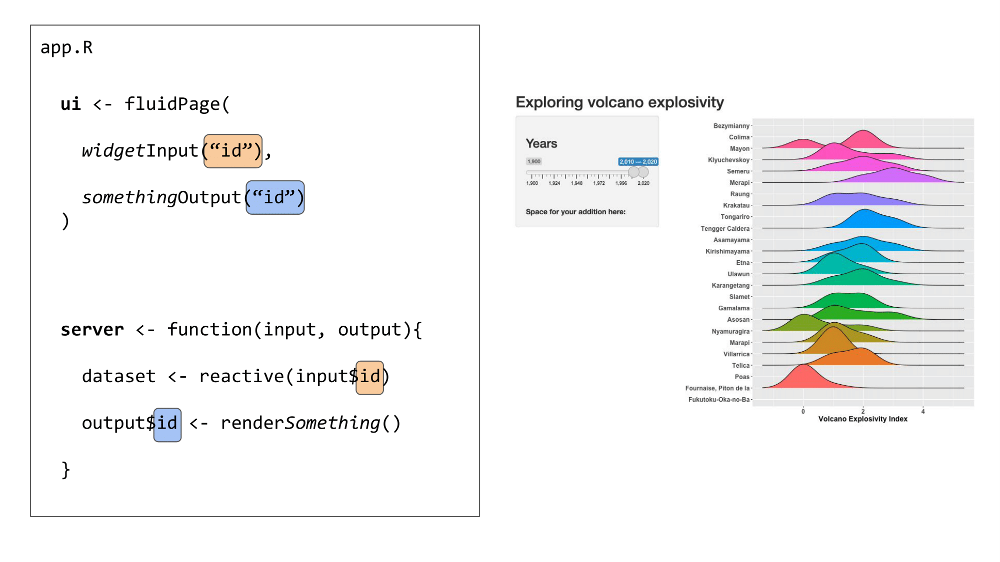
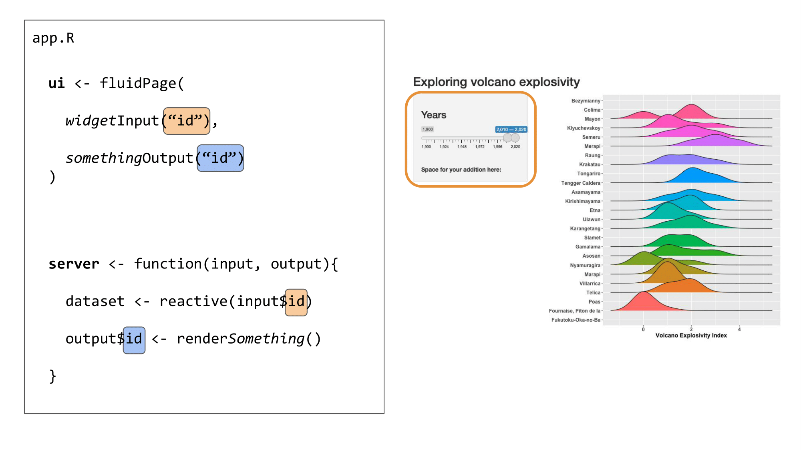
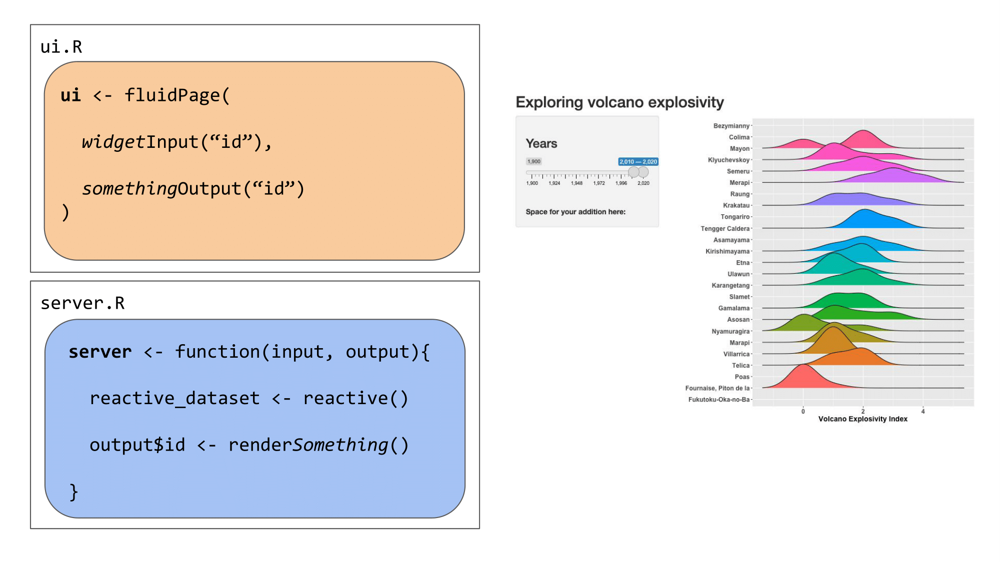

```{r, include = FALSE, echo = FALSE}
# default to not evaluate chunks
knitr::opts_chunk$set(eval = FALSE)
```


## Plots

Shiny is an excellent tool for visual exploration - it is at its most useful when a user can *see* something change before their eyes according to some selections. This is a great way to allow users to explore a dataset, explore the results of some analyses according to different parameters, and so on!

Let's now add a plot to our Shiny app, to visualize the distribution of a variable depending on user input. We'll be adding the `ggplot2` and `ggridges` packages in the set-up step at the top of our `app.R` to allow us to make a plot.

```{r}
# load packages
library(shiny)
library(ggridges)
library(ggplot2)
library(here)
library(readr)
```

### User interface

To add a plot in our Shiny, we need to indicate where the plot should appear in the app. We can do this with `plotOutput()`, a similar function to `tableOutput()` in the previous section that is meant for plot outputs, as the name suggests.

```{r}
# Define UI for application that makes a table andplots the Volcano Explosivity 
# Index for the most eruptive volcanoes within a selected range of years

ui <- fluidPage(
  
  # Application title ----
  
  titlePanel("Exploring volcano explosivity"),
  
  # Input interface ----
  
  sidebarLayout(
    sidebarPanel(
      
      # Sidebar with a slider range input
      sliderInput("years", # the id your server needs to use the selected value
                  label = h3("Years"),
                  min = 1900, max = 2020, # maximum range that can be selected
                  value = c(2010, 2020) # this is the default slider position
      )
    )
  ),
  
  # Show the outputs from the server ---------------
  mainPanel(
    
    # Show a ridgeplot of explosivity index for selected volcanoes
    plotOutput("ridgePlot"),
    
    # then, show the table we made in the previous step
    tableOutput("erupt_table")
    
  )
)
```

Now our Shiny app knows where we want to place our plot.

### Server

We now need to create the plot we want to show in our app. This plot will change depending on one or several reactive values that the user can input or select in our UI.

We link the UI and server together with IDs that are assigned to each object. Above, we told the UI to expect a plot output with the ID `"ridgePlot"`. In the server, we will create a plot and render it as a plot object using `renderPlot()`, and we will assign this plot output to the ID we call in the UI (as `output$ridgePlot`).

```{r}
# Define server logic required to make your output(s)
server <- function(input, output) {

  
  # prepare the data
  # ----------------------------------------------------------
  
  # read the dataset
  eruptions <- readr::read_rds(here::here("data", "eruptions.rds"))
  
  # filter the dataset to avoid overloading the plot 
  eruptions <- eruptions[which(eruptions$volcano_name %in% names(which(table(eruptions$volcano_name) > 30))),]
  # this subsets to volcanoes that have erupted more than 30 times
  
  
  # make reactive dataset
  # ----------------------------------------------------------
  
  # subset volcano data with input year range
  eruptions_filtered <- reactive({
    subset(eruptions, start_year >= input$years[1] & end_year <= input$years[2])
  })
  
    
  # create and render the outputs
  # ----------------------------------------------------------
  
  # create the table of volcanoes
  output$erupt_table <- renderTable({
    head(eruptions_filtered())
  })
  
  # render the plot output
  output$ridgePlot <- renderPlot({
    
    # create the plot
    ggplot(data = eruptions_filtered(),
           aes(x = vei,
               y = volcano_name,
               fill = volcano_name)) +
      # we are using a ridgeplot geom here, from the ggridges package
      geom_density_ridges( size = .5) + # line width
      
      # label the axes
      labs(x = "Volcano Explosivity Index", y = "") +
      
      # adjust the ggplot theme to make the plot "prettier"
      theme_classic() + 
      theme(legend.position = "none",
            axis.text = element_text(size = 12, face = "bold"),
            axis.title = element_text(size = 14, face = "bold"))
  })
}
```

### The Shiny app

Now, if we run the Shiny app, we have a plot above the table we made previously. They are positioned in this way because the `plotOutput()` comes before the `tableOutput()` in the UI.

```{r eval = FALSE}
# Run the application
shinyApp(ui = ui, server = server)
```


## Review: How a Shiny app works

### Building blocks

We've now seen the basic building blocks of a Shiny app:

- The **user interface**, which determines how the app "looks". This is how we tell Shiny where to ask for user inputs, and where to put any outputs we create.
- **Reactive values**, which are values that change according to user inputs. These are values that affect the outputs we create in the Shiny app, such as tables or plots.
- The **server**, where we use reactive values to generate some outputs.

### IDs

The **user interface** and **server** communicate through IDs that we assign to inputs from the user and outputs from the server.



We use an ID (*in orange*) to link the user input in the UI to the reactive values used in the server:



We use another ID (*in blue*) to link the output created in the server to the output shown in the user interface:


### Organisation

These elements can all be placed in one script named `app.R` or separately in scripts named `ui.R` and `server.R`. The choice is up to you, although it becomes easier to work in separate `ui.R` and `server.R` scripts when the Shiny app becomes more complex.


**Example 1: Everything in `app.R`**


**Example 2: Split things into `ui.R` and `server.R`**




## Customising the theme

If you'd like to go one step further, you can also customize the appearance of your Shiny app using built-in themes, or creating your own themes.

### Using built-in themes

There are several built-in themes in Shiny, which allow you to quickly change the appearance of your app. You can browse a gallery of available themes here [here](https://rstudio.github.io/shinythemes/), or test themes out interactively [here](https://shiny.rstudio.com/gallery/shiny-theme-selector.html).

Let's try the *darkly* theme on our Shiny app. To do this, we will need the `shinythemes` package.

```{r}
library(shinythemes)
```

We can change the theme of our previous app with one line of code:

```{r}
# Define UI for application that makes a table andplots the Volcano Explosivity 
# Index for the most eruptive volcanoes within a selected range of years

ui <- fluidPage(
  
  # Application title ----
  
  titlePanel("Exploring volcano explosivity"),
  
  # Input interface ----
  
  sidebarLayout(
    sidebarPanel(
      
      # Sidebar with a slider range input
      sliderInput("years", # the id your server needs to use the selected value
                  label = h3("Years"),
                  min = 1900, max = 2020, # maximum range that can be selected
                  value = c(2010, 2020) # this is the default slider position
      )
    )
  ),
  
  # Show the outputs from the server ---------------
  mainPanel(
    
    # Show a ridgeplot of explosivity index for selected volcanoes
    plotOutput("ridgePlot"),
    
    # then, show the table we made in the previous step
    tableOutput("erupt_table")
    
  ),
  
  # Customize the theme ----------------------
  
  # Use the darkly theme
  theme = shinythemes::shinytheme("darkly")
)
```

Now, if we run the app, it looks a little different:


### Using a custom theme

You can also go beyond the built-in themes, and create your own custom theme with the fonts and colours of your choice. You can also apply this theme to the outputs rendered in the app, to bring all the visuals together for a more cohesive look.


#### Customizing a theme

To create a custom theme, we will be using the `bs_theme()` function from the `bslib` package. 

```{r}
library(bslib)
```

```{r}
# Create a custom theme 
cute_theme <- bslib::bs_theme(
  
  bg = "#36393B", # background colour
  fg = "#FFD166", # most of the text on your app
  primary = "#F26430", # buttons, ...
  
  # you can also choose fonts
  base_font = font_google("Open Sans"),
  heading_font = font_google("Open Sans")
)
```

To apply this theme to our Shiny app (and the outputs), we will be using the `thematic` package. 

```{r}
library(thematic)
```


There are two essential steps to apply a custom theme to a Shiny app: 

1. Activating thematic.
2. Setting the user interface's theme to the custom theme (`cute_theme`).

```{r}
# Activate thematic
# so your R outputs will be changed to match up with your chosen styling
thematic::thematic_shiny()

# Define UI for application that makes a table andplots the Volcano Explosivity 
# Index for the most eruptive volcanoes within a selected range of years

ui <- fluidPage(
  
  # Application title ----
  
  titlePanel("Exploring volcano explosivity"),
  
  # Input interface ----
  
  sidebarLayout(
    sidebarPanel(
      
      # Sidebar with a slider range input
      sliderInput("years", # the id your server needs to use the selected value
                  label = h3("Years"),
                  min = 1900, max = 2020, # maximum range that can be selected
                  value = c(2010, 2020) # this is the default slider position
      )
    )
  ),
  
  # Show the outputs from the server ---------------
  mainPanel(
    
    # Show a ridgeplot of explosivity index for selected volcanoes
    plotOutput("ridgePlot"),
    
    # then, show the table we made in the previous step
    tableOutput("erupt_table")
    
  ),
  
  # Customize the theme ----------------------
  
  # Use our custom theme
  theme = cute_theme
)
```

Now, if we run the app, the user interface and plot theme is set to the colours and fonts we set in `cute_theme`:


Here, `thematic` is not changing the colours used to represent a variable in our plot, because this is an informative colour scale (unlike the colour of axis labels, lines, and the plot background). However, if we remove this colour variable in our ridgeplot in the server, thematic will change the plot colours as well. Here is a simplified example of our server to see what these changes would look like:

```{r}
# Define server logic required to make your output(s)
server <- function(input, output) {
  
  #... (all the good stuff we wrote above)
  
  # render the plot output
  output$ridgePlot <- renderPlot({
    
    # create the plot
    ggplot(data = eruptions_filtered(),
           aes(x = vei,
               y = volcano_name)) + # we are no longer setting 
             # the fill argument to a variable
             
             # we are using a ridgeplot geom here, from the ggridges package
             geom_density_ridges(size = .5) + 
             
             # label the axes
             labs(x = "Volcano Explosivity Index", y = "") +
             
             # remove the "classic" ggplot2 so it doesn't override thematic's changes
             # theme_classic() + 
             theme(legend.position = "none",
                   axis.text = element_text(size = 12, face = "bold"),
                   axis.title = element_text(size = 14, face = "bold"))
           })
    }
```

Now, our plot's theme follows the app's custom theme as well:


