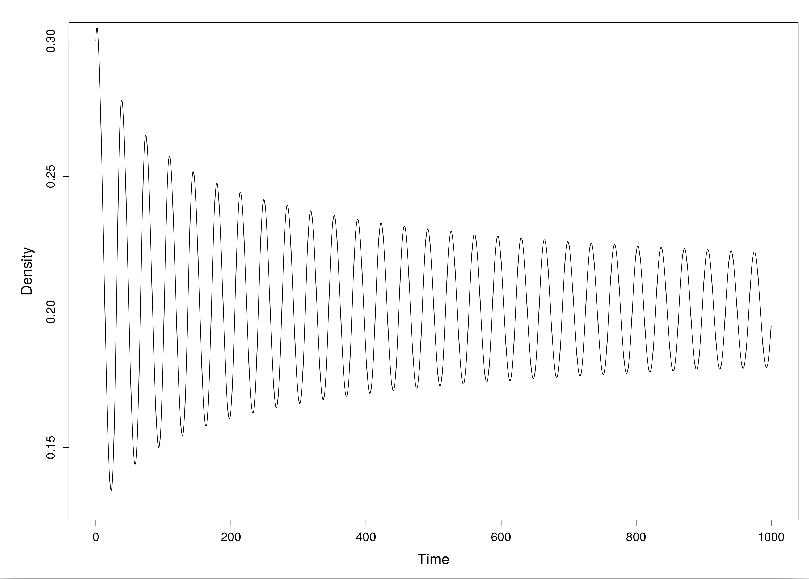
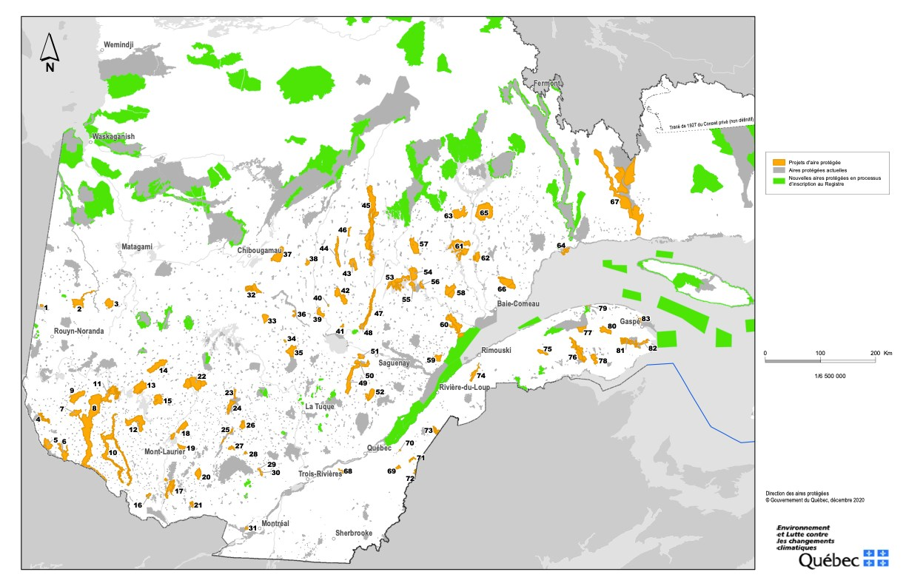
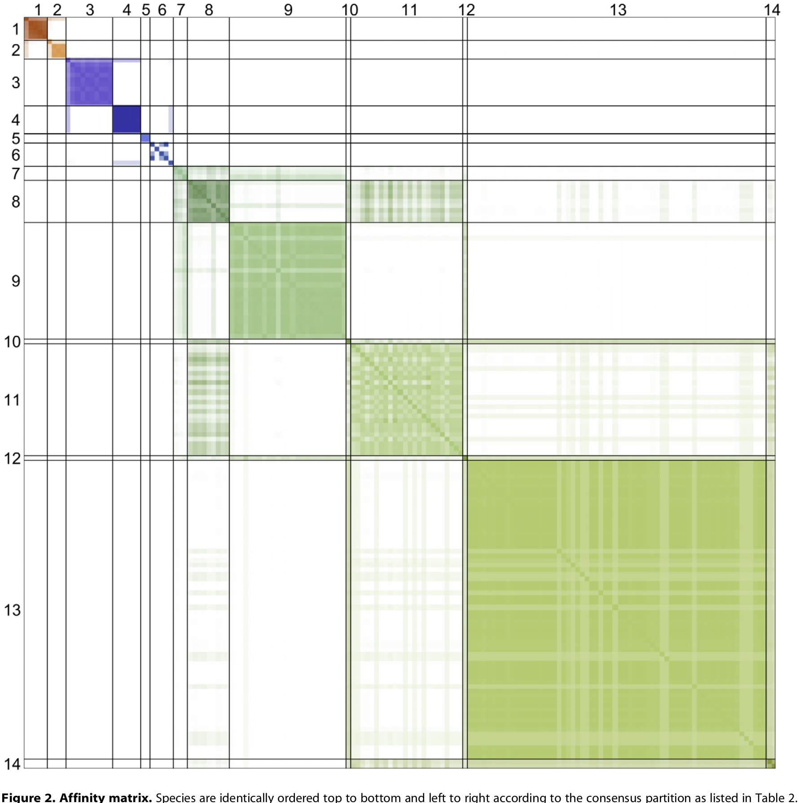
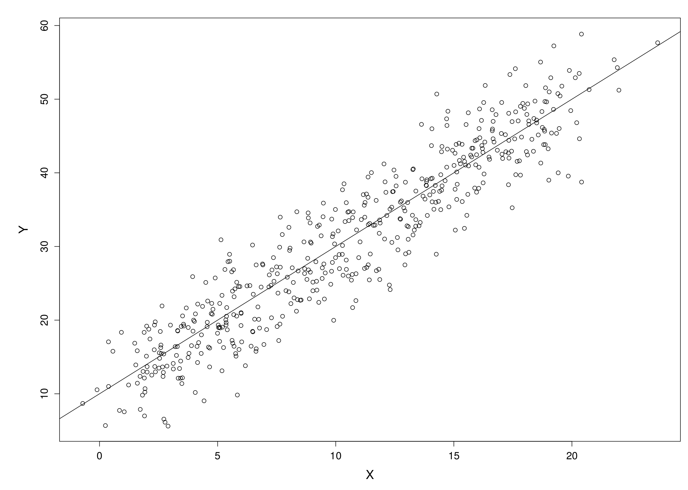
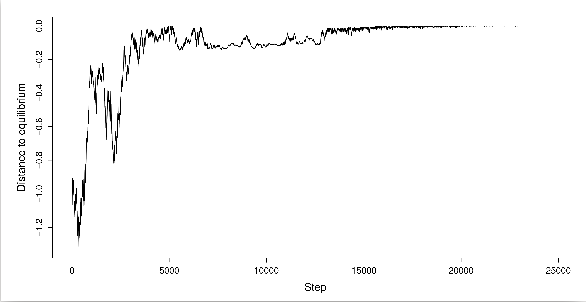

class: title-slide, middle

<style type="text/css">
  .title-slide {
    background-image: url('../assets/img/bg.jpg');
    background-color: #23373B;
    background-size: contain;
    border: 0px;
    background-position: 600px 0;
    line-height: 1;
  }
</style>

# Model evaluation with ecological data

<hr width="65%" align="left" size="0.3" color="orange"></hr>

## Optimization algorithms

<hr width="65%" align="left" size="0.3" color="orange" style="margin-bottom:40px;" alt="@Martin Sanchez"></hr>

.instructors[
  **ECL707/807** - Dominique Gravel
]

</img>

---

# Objective

The objective of an optimization algorithm is to find the best solution that either maximize or minimize a complex function. 

---

# Differential equations

<div style='text-align:center;'>
  </img>
</div>

Objective : find the abundances that make differential equations equal to 0.

---

# Spatial arrangement of protected areas 

<div style='text-align:center;'>
  </img>
</div>

Objective : protect the largest area, the largest biodiversity and minimize the economical consequences

---

# Modules in an ecological network 

<div style='text-align:center;'>
  </img>
</div>

Objective : maximize the number of intra module interactions and minimize the number of inter modules interactions

---

# Parameters of a statistical model 

<div style='text-align:center;'>
  </img>
</div>

Objective : maximize the likelihood

---

# Many algorithms 

- Brute force/direct search
- Derivative-based methods
- Nelder-mean (simplex)
- Genetic algorithm
- Simulated annealing$^*$
- Monte Carlo Markov Chain+$^*$

$^*$ These are not optimization procedures per se as they are meant to return a distribution of solutions, amont which you may want to pick the best one.

---

# Derivative
## A binomial model

We previously discussed a seed predation experiment. A total of $k = 941$ seeds were sown, with $n = 51$ that were predated. What is the maximum likelihood estimate of the predation rate ?

**Step 1**: the likelihood of observing $n$ seeds predated our of $k$ seeds planted dependts on the parameter $\theta$ as follows :

$$ \zeta(n, \theta) \propto \theta^n (1-\theta)^{k - n}$$

**Step 2**: differentiate this function with respect to the parameter $\theta$

$$\frac{\partial \zeta}{\partial \theta} = \frac{n}{\theta} - \frac{k-n}{1-\theta}$$

---

# Derivative
## A binomial model

**Step 3**: solve the equation and isolate $\theta$

$$\theta = \frac{n}{k}$$

---

# Derivative
## A binomial model

**Which gives**

```{r, echo = FALSE}
theta <- seq(0,1,0.001)
lik = dbinom(51, 951, prob = theta)
plot(theta, lik, type = "l", xlab = "theta", ylab ="Likelihood", cex.axis = 1.5, cex.lab = 1.25)
```

---

# But ....

```{r, echo = FALSE}
h = function(x,y) {(x*sin(20*y)+y*sin(20*x))^2*cosh(sin(10*x)*x)+(x*cos(10*y)-y*sin(10*x))^2*cosh(cos(20*y)*y)}
x = y = seq(-3,3,le=435)
z = outer(x,y,h)
par(bg = "wheat",mar = c(1,1,1,1))
persp(x,y,z,theta=155,phi=30,col = "green4",ltheta=-120,shade=0.75,border=NA,box=FALSE)
```

---

class: inverse, middle, center

# What do we do when there are multiple peaks ? When solutions are not continuous ? When we don't have a function to derivate ?

<hr width="65%" size="0.3" color="orange" style="margin-top:-20px;"></hr>

---

# Brute force
## Grid search

```{r, eval = FALSE}
X <- runif(n = 10, min = 0, max = 10)
Y <- rnorm(n = 10, mean = 0.5 + 1.2*X, sd = 1.5)
ll <- function(X,Y,a,b, sd) {
	pred <- a + b*X
	sum(dnorm(Y, pred, sd, log = TRUE))
}
a_seq <- seq(-5,5,length.out = 1000)
b_seq <- seq(0,5,length.out = 1000)
grid <- expand.grid(a_seq,b_seq)
res <- numeric(1000*1000)
for(i in 1:nrow(grid)) 
	res[i] <- ll(X,Y,grid[i,1],grid[i,2],sd=2)
z <- matrix(res, nr = 1000, nc = 1000)
contour(a_seq,b_seq,z, xlab = "Intercept", 
	ylab = "Slope",nlevels=50)
```

---

# The brute force approach: grid search

```{r, echo = FALSE}
X <- runif(n = 10, min = 0, max = 10)
Y <- rnorm(n = 10, mean = 0.5 + 1.2*X, sd = 1.5)
ll <- function(X,Y,a,b, sd) {
	pred <- a + b*X
	sum(dnorm(Y, pred, sd, log = TRUE))
}
a_seq <- seq(-5,5,length.out = 100)
b_seq <- seq(0,5,length.out = 100)
grid <- expand.grid(a_seq,b_seq)
res <- numeric(100*100)
for(i in 1:nrow(grid)) res[i] <- ll(X,Y,grid[i,1],grid[i,2],sd=2)
z <- matrix(res, nr = 100, nc = 100)
contour(a_seq,b_seq,z, xlab = "Intercept", ylab = "Slope",nlevels=50)
```

---

# Exercise 3.1. 

1. Implement the following function :

```{r, echo = TRUE, eval = FALSE}
h = function(x,y) {(x*sin(20*y)+y*sin(20*x))^2*cosh(sin(10*x)*x)+(x*cos(10*y)-y*sin(10*x))^2*cosh(cos(20*y)*y)}
```

2. Run a grid search to find the best $(x,y)$ coordinates maximizing this function

---

class: inverse, middle, center

# What to do when there are many parameters to evaluate ? When solutions are not "parameters" ?

<hr width="65%" size="0.3" color="orange" style="margin-top:-20px;"></hr>

---

# Simulated annealing

The name of the method is coming from metallurgy, by analogy to the movement of atoms in a hot piece of metal as it cools down. Simulated annealing interprets cooling as a slow decrease in the probability of accepting a bad proposition of parameter values as it explores the solution space. Accepting worse solutions is a fundamental property of the method which allows an extensive search of the solution space and avoid getting stuck on local optima. The method is an adaptation of the Metropolis–Hastings algorithm.

---

# Simulated annealing

<div style='text-align:center;'>
  </img>
</div>

---

# Simulated annealing

Accept the candidate solution :

$$\theta_{t+1} = \theta_t + \delta$$

with probability:
		
$$\rho = exp(\Delta h/T_t)$$

---

# Simulated annealing 

<div style='text-align:center;'>
  </img>
</div>

---

# Simulated annealing
## Pseudo-code

```
	DEFINE function to optimize h(X)
	DEFINE the sampling function c(X)
	DEFINE temperature sequence
```

---

# Simulated annealing
## Pseudo-code

```
	REPEAT
		DRAW sample X from c(x)
		COMPUTE difference diff = h(X) - h(X_0)
		IF diff > 0 ACCEPT X
		ELSE 
			COMPUTE acceptance probability p = exp(diff/T)
			DRAW value P from random uniform on (0,1)
			IF P < p
				ACCEPT X
			ELSE
			    REJECT X
		UPDATE temperature
	UNTIL nsteps is reached
```

---

# Exercise 2.2. 

1. Write your own simulated annealing function  from the pseudo code
2. Make sure it works running it on a set of numbers and calculating the mean
3. Then take the previous function and find the maximum using simulated annealing

For advanced users, compare the performance of the two methods in the precision of the solution and the time to solve it. 

For advanced advanced users, compute the derivative and solve it analytically!

---

# Function to optimize

```{r, echo = FALSE}

f <- function(x) exp(-(x+sin(3*x))^2+0.195)/2

```

---

# Initiating the algorithm

```{r, echo = FALSE}
# Control parameters

T <- 10 
delta_T <- 1/2500
nsteps <- 25000
step_par <- 0.1

# Starting condition
actual_par <- runif(1, -3, 3)

```

---

# Main loop

```{r, echo = FALSE}
# Main loop
for(i in 1:nsteps) {

	# Draw new value for x
	new_par <- actual_par + (runif(1)*2-1)*step_par

	# Evaluate the function
	actual_f <- f(actual_par)
	new_f <- f(new_par)

	# Compute the difference
	diff <- new_f - actual_f
	if(diff > 0) actual_par <- new_par

	else {
		# Evaluate acceptance probability	
		p_accept <- exp(-diff/T)
		if(p_accept > runif(1)) actual_par = new_par
	
	}

	# Update temperature
	T = (1-delta_T)*T

	}

```

---

# Simulated annealing

As you see with this example, simulated annealing is an optimization method meant to solve all kinds of problems, not only maximum likelihood. 

But now it's time to get back at the hemlock dataset and find the MLE.

---

# Exercise 3.3. 

1. Load the hemlock data
2. Write your likelihood function to maximize
3. Adapt your simulated annealing algorithm to the problem 
4. Find the best parameters. Check if they compare to Coates and Burton (1999)

---

# Debugging

- Temperature sequence : too low ? too high ?
- Search space 
- Jumps between parameter sets 
- Different scales
- Computational errors (e.g. division by 0, log negative numbers)
- Too many parameters
- Parameter tradeoffs (a null cline in the parameter space)
- Dependence on initial conditions (mostly for rough surfaces with several peaks)
- Inefficient code (use vectorization when possible and avoid loops)

---

# Many algorithms : Which one to pick ?

- The equation to optimize
- The size of the dataset
- Number of parameters
- Likelihood surface
- Area for the optimal solution or precise value ?
- Confidence interval ?
- Combining methods ?

---

# Available algorithms on R

**optim {stats}**

General-purpose optimization based on Nelder-Mead, quasi-Newton and conjugate-gradient algorithms. It includes an option for box-constrained optimization and simulated annealing. 

- Accessible
- Can return the Hessian matrix if required
- Very rapid
- Very precise
- Local optimization only, performs badly for rough surfaces
- May be hard to constrain parameter search

---

# Available algorithms on R

**GenSA {GenSA}**

This function searches for global minimum of a very complex non-linear objective function with a very large number of optima. 

- Very good with rough surfaces
- Fairly rapid and easy to implement
- Possible to constrain parameter search with minimal and maximal boundaries
- Makes multiple runs
- Hard to control cooling sequence, number of iterations and the random seed generator

---

# Advantages of using your own SA
## A lot of control and customization

- Random number generator
- Cooling sequence
- Search space 
- Even possible to include prior information
- Possible to adapt to any optimization problem 

---

# Best practices
## Simulated datasets

Before applying your optimization algorithm to a full dataset, which may be very long to run (ie from hours to days), make sure the algorithm works properly and will converge to the good solution. 

An easy to get there is to use the scientific model, propose a parameter set and the relevance random number generator (will correspond to your PDF) and generate a fake dataset. Run the SA algorithm on this fake dataset first to make sure it converges before trying it on a real dataset. 

You may try with an increasing amount of noise. 