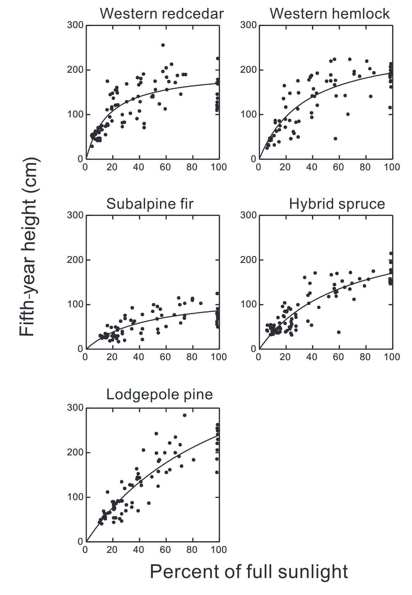
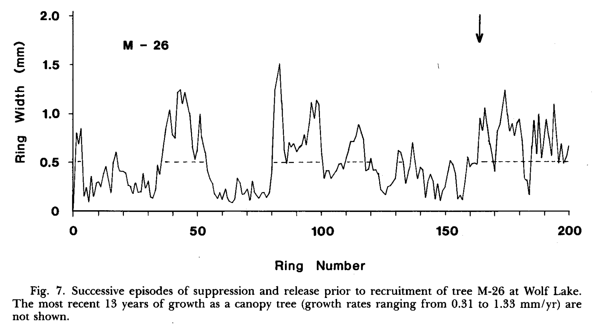
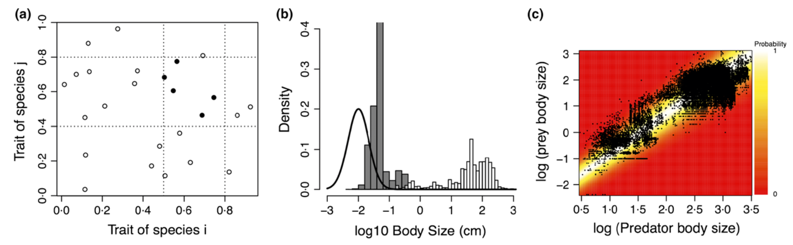
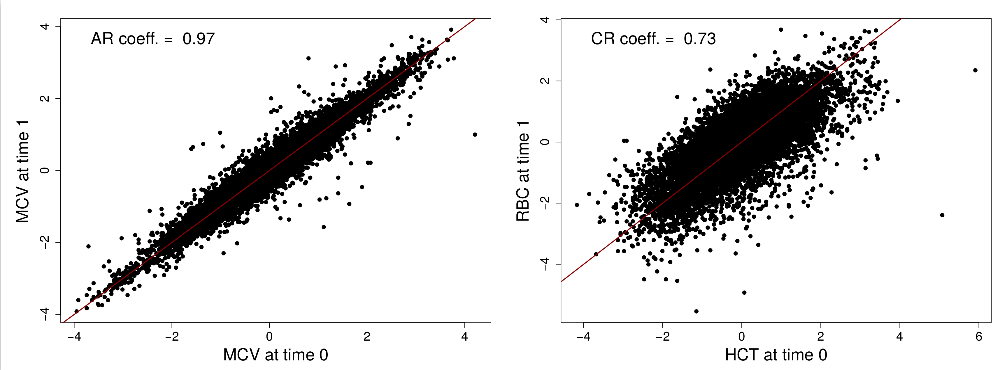
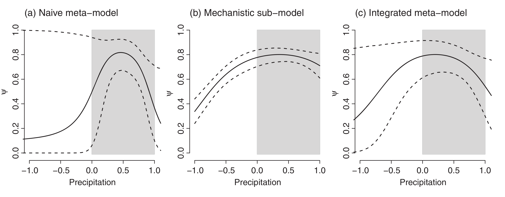
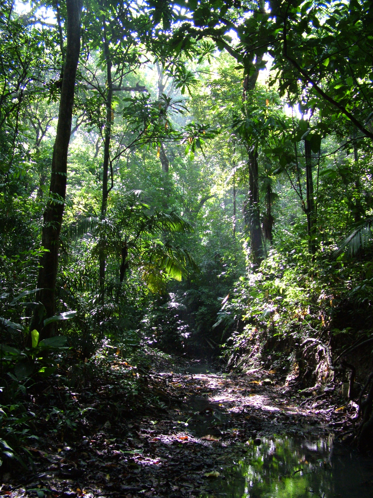

class: title-slide, middle

# Model evaluation with ecological data

## Introduction

.instructors[
  **ECL707/807** - Dominique Gravel
]

</img>

---

# Let's start with a simple problem  

  </img>

Coates and Burton (1999) studied the effect of light availability on the annual height increment as a function of an index of light availability, 5 years after they were planted. 

---

# Let's start with a simple problem  

  </img>

What could you tell from the data ? 

---

# Let's start with a simple problem  

  </img>

How would you fit a curve into this ? 

---

# Let's start with a simple problem  

  </img>

What equation to pick ?

---
class: inverse, middle, center

# Now try it !

---

# Let's start with a simple problem  

  </img>

What are the uncertainties in your model ?

---

# Let's start with a simple problem  

  </img>

What will happen if we sample more ?

---

# Let's start with a simple problem  

  </img>

Can we reduce this uncertainty ? 

---

class: inverse, middle, center

# Why to develop modelling skills ?

---

# Develop innovative methods

Objective : detect events of suppression and release of understory saplings using time series

  </img>

*Gravel et al. 2010. Large-scale synchrony of gap dynamics and the distribution of understory tree species in maple-beech forests. Oecologia 162 : 153-161.*

---

# Complex probabilistic problems 

Objective : evaluate a logistic model with presence only-data

  </img>

*Bartomeus et al. 2016. A common framework for identifying linkage rules across different types of interactions. Functional Ecology 30: 1894-1903*

---

# Complex probabilistic problems 

Objective : evaluate non-stationary auto-regressive multivariate models

  </img>

*Gravel et al. Evidence of critical slowing down of interaction networks before physiological meltdown. In prep.*

---

# Transfer of information across scales

Objective : make sure that a species distribution model evaluated at continental scale is coherent with experiments done at the micro scale

  </img>

*Talluto et al. 2016. Cross-scale integration of knowledge for predicting species ranges : a metamodelling framework. Global Ecology and Biogeography 25 : 238-249.* 

---

# Use all information available 

Objective : how to evaluate mortality rate of rare tropical trees with very few observations ?

  </img>

*Condit et al. 2006. The importance of dempraphic niches to tree diversity. Science 313: 98-101.*

---

# Other motivations

- Philosophical motivation
- Representation of uncertainty
- Adaptive modelling
- Better understand statistics

---
class: inverse, middle, center

# What about you ?

---

# Logistics

- On site and remote teaching
- Lectures are recorded
- Priority to exercises and problems
- Minimal interactive lectures
- Participation 

Any other suggestion ?

---

# Content

1. Probabilities
2. Maximum likelihood estimation
3. Algorithms for optimization
4. Bayesian models
5. Algorithms for posterior distributions

---

# Expectations

- Write down an equation for likelihood and code it in R
- Develop an algorithm to find the maximum likelihood estimates
- Have some notions of the philosophies of satistical inferrence
- Develop the full equation for the posterior distribution 
- Estimate posterior distribution by MCMC for a simple regression problem

---

# Evaluation

- Pass or fail based on participation and progress
- Auto-evaluation form at the end of the course
- Possibility of doing a supervised project as a side