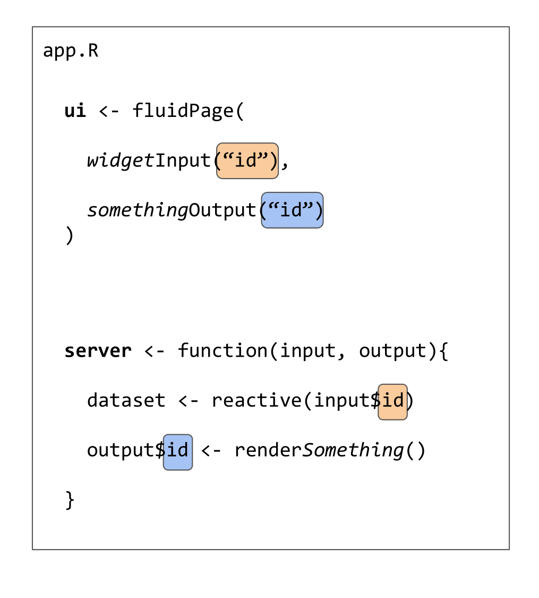
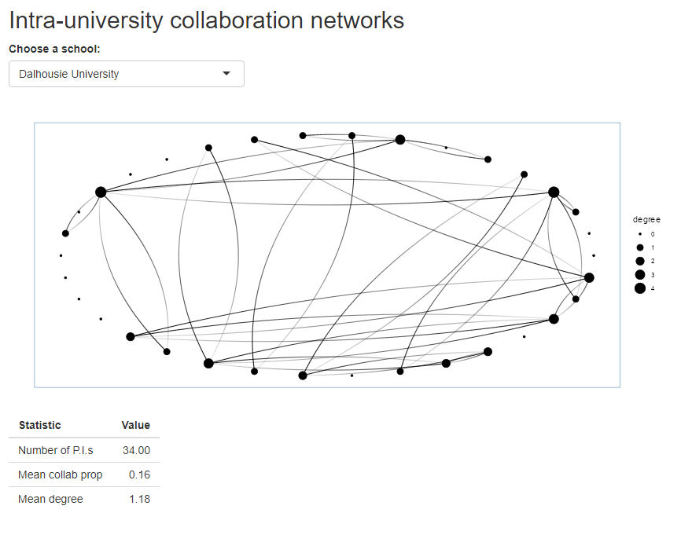
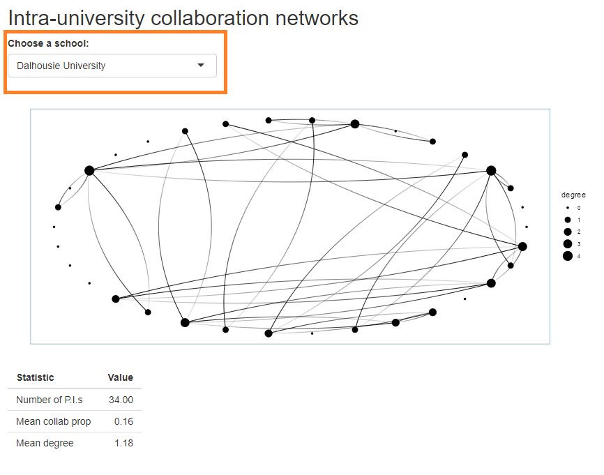
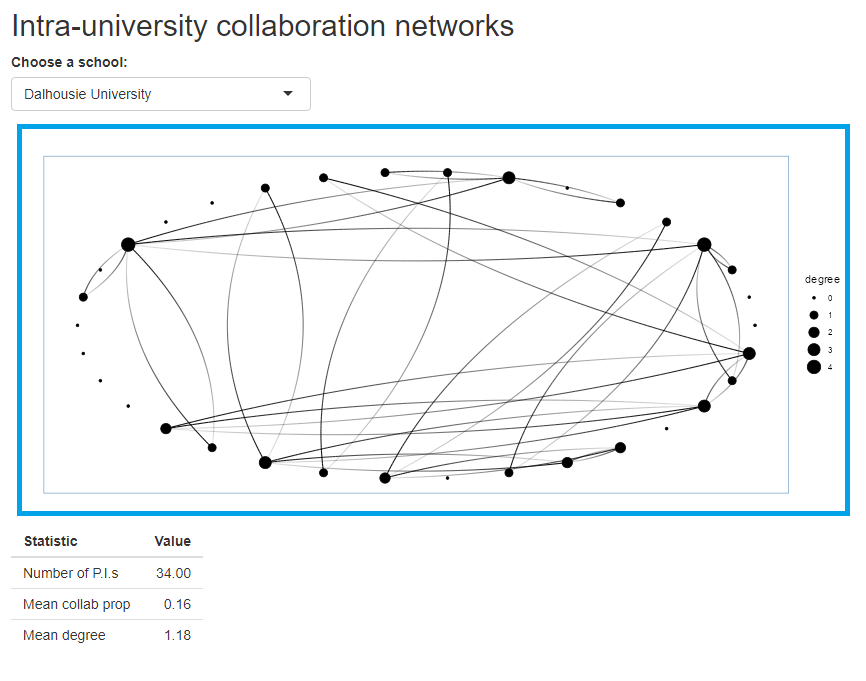
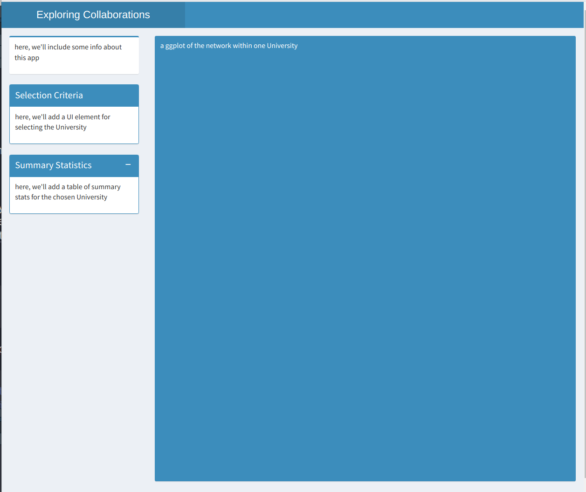
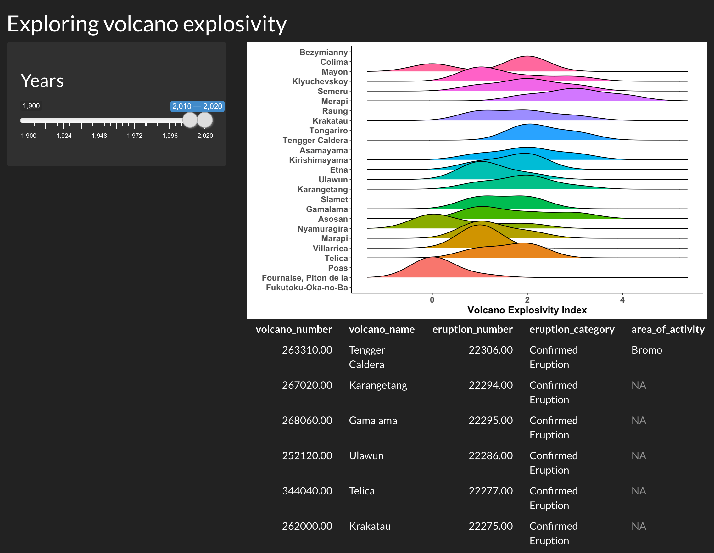
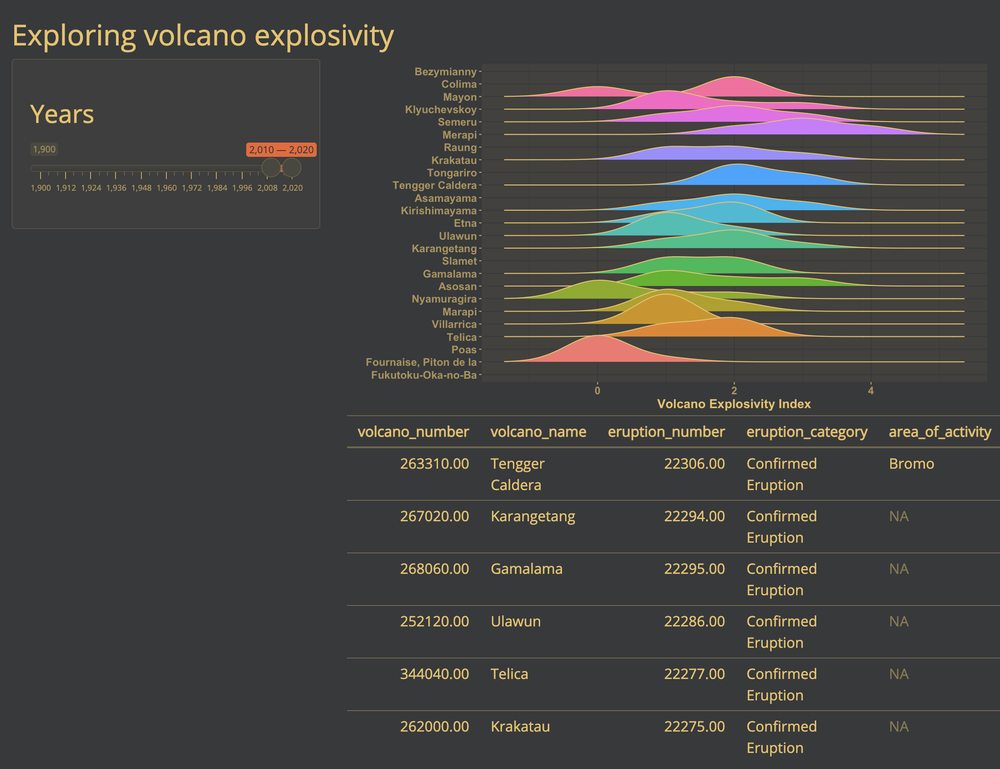
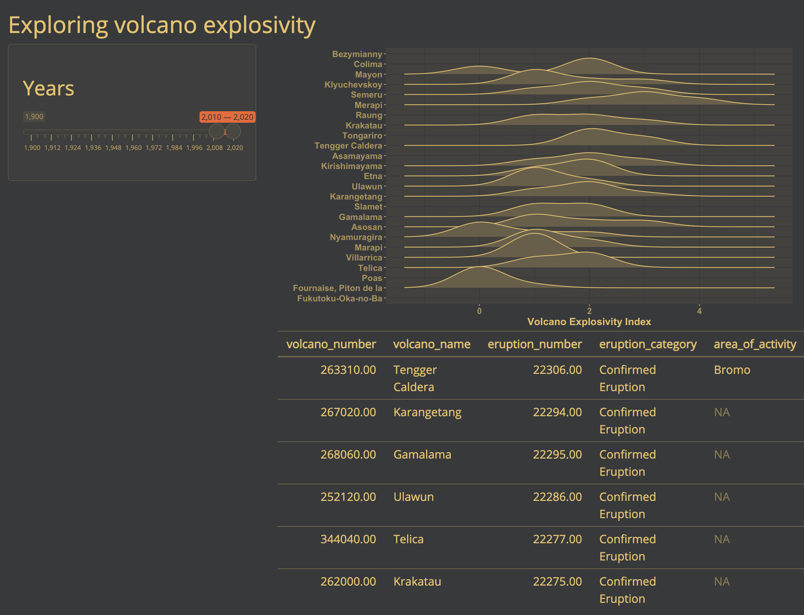

```{r setup, include=FALSE}
knitr::opts_chunk$set(dev = "ragg_png")
```


## Introduction

### Why do you want to use Shiny?

There are many reasons to consider using Shiny for a project:

-   Sharing results from a paper with your readers
-   Helping you explore a model, mathematics, or simulations
-   Letting non R users use R.

### Objectives of this workshop

* Give an overview of how and why to use a Shiny app
* Provide an introduction to a few important Shiny concepts
* Give you time to practice on your own!

### Some examples of Shiny in practice! 

* [Census aggregator, Sharla Greenfeld](https://censusaggregator.ca/)
* [Lake Eerie fish explorer, USGS](https://lebs.shinyapps.io/western-basin/)
* [Scotian Shelf MPAs, Jake Lawlor](https://jakelawlor.shinyapps.io/ScotianShelfMPAs/)

## Background content

### Lists, functions & plotting in R

To ease into things, we will familiarize ourselves with the data that we will use to create a Shiny app together. At the same time, we will practice indexing **lists**, **plotting**, and making **functions**. By the end of this section, we will have made a plot that we will add interactivity to using Shiny.

### The data 

We will be using a dataset on **networks of scientific collaboration** within the ecology and evolution departments of 25 Canadian universities. For each university, we have a count of the number of co-authored publications between each pair of ecology and evolution professors. 

[Lucas Eckert](https://www.lucaseckert.ca/) has kindly provided us with this data, and will be giving a talk on patterns of collaboration on Wednesday July 9th at 4:00pm (don't miss it!).

Let's explore the data:

```{r read-data}
#| warning: false

## read in the data 
intra_list <- readr::read_rds(here::here("posts/2025-07-06-CSEE-intro-shiny/intra-list_clean.RDS"))

## what type of object are the data are stored in?
class(intra_list)

```

As you can see, the data are stored in a **list** object. 

:::{.callout-note appearance="minimal" collapse="true"}
### Introduction to Lists

In R lists act as containers. Unlike atomic vectors, the contents of a list are not restricted to a single mode and can encompass any mixture of data types. Lists are sometimes called generic vectors, because the elements of a list can by of any type of R object, even lists containing further lists. This property makes them fundamentally different from atomic vectors.

A list is a special type of vector. Each element can be a different type.

Create lists using ```list()```:

```{r one-list}

x <- list(5, "a", TRUE)
x

```

The content of elements of a list can be retrieved by using double square brackets.

```{r square-bracket}

x[[1]]

```

Elements of a list can be named (i.e. lists can have the names attribute).

```{r naming-list}

names(x) <- c("number", "string", "boolean")
names(x)

```

And elements can be accessed by their names:

```{r subset-byname}

x[["string"]]
x$string

```

:::

In our ```data``` list, each **element** of the list stores the collaboration network within one university, and the **names** attribute tells which university. 

:::{.callout-tip}
### EXERCISE
Try indexing ```intra_list``` to get the collaboration network for McGill University. 
What is the shape of the resulting dataset? (list, matrix, data frame, vector etc)
:::

:::{.callout-note collapse="true"}
### SOLUTION
```{r make-network}
## get the names of elements on our list
names(intra_list)

## access element containing data for McGill University
network <-  intra_list[['McGill University']]

network[1:5, 1:5]
```

Let's look at the format of the list elements:

```{r view-network, eval = FALSE}

## view the data:
View(network)

```

Each university collaboration network is represented by a 2D matrix (similar to one used to represent species interaction networks) where rows and columns represent researchers and cells contain the number of shared publications between two researchers. 
:::

## Plotting 

Our shiny app will feature visualizations of this dataset. Here is a short introduction to plotting in ggplot2, followed by a demonstration of a network plot using ggraph.

:::{.callout-note appearance="minimal" collapse="true"}
### Introduction to ggplot2

We are going to be using **functions** from the ```ggplot2``` package to create visualizations of data. Functions are predefined bits of code that automate more complicated actions. R itself has many built-in functions, but we can access many more by loading other packages of functions and data into R.

If you don't yet have this package installed, run this line of code:
```{r install-ggplot2, eval = FALSE}

install.packages("ggplot2")

```

And load the package using the ```library()``` function:
```{r load-ggplot2}
# load package
library(ggplot2)
library(palmerpenguins)
```

Let's also load a dataset to practice making a plot with:

```{r load-penguins}
data("penguins")
```

```{r}
#| results: asis
knitr::kable(head(penguins))
```


ggplot2 is a powerful package that allows you to create complex plots from tabular data (data in a table format with rows and columns). The gg in ggplot2 stands for “grammar of graphics”, and the package uses consistent vocabulary to create plots of widely varying types. Therefore, we only need small changes to our code if the underlying data changes or we decide to make a box plot instead of a scatter plot. This approach helps you create publication-quality plots with minimal adjusting and tweaking.

ggplot plots are built step by step by adding new layers, which allows for extensive flexibility and customization of plots.

We use the ```ggplot()``` function to create a plot. In order to tell it what data to use, we need to specify the data argument. An argument is an input that a function takes, and you set arguments using the ```=``` sign.

```{r empty-plot}
ggplot(data = penguins)
```

We get a blank plot because we haven’t told ```ggplot()``` which variables we want to correspond to parts of the plot. We do this using the ```mapping``` argument. We can specify the “mapping” of variables to plot elements, such as x/y coordinates, size, or shape, by using the ```aes()``` function.


```{r axisonly-plot, eval = TRUE}
ggplot(data = penguins, mapping = aes(x = bill_length_mm, y = bill_depth_mm))
```

Now we’ve got a plot with x and y axes corresponding to variables from the iris data. However, we haven’t specified how we want the data to be displayed. We do this using ```geom_``` functions, which specify the type of geometry we want, such as points, lines, or bars. We can add a ```geom_point()``` layer to our plot by using the + sign. We indent onto a new line to make it easier to read, and we have to end the first line with the ```+``` sign.

```{r dot-plot}

ggplot(data = penguins, mapping = aes(x = bill_length_mm, y = bill_depth_mm)) +
  geom_point()

```

:::

### Plotting collaboration networks

We want our app to display the collaboration network for a university that the user of our Shiny app will select, so let's start by making a plot of the collaboration network for McGill University. 

ggplot likes ```tidy``` data, where each row of the data is an observation and each column represents different variables describing that observation. Because our network data are not in this format, we need the help of another package called ```tidygraph``` to plot them. Let's install and load it:

```{r demo-tidygraph}
# install.packages("tidygraph")
library(tidygraph)
library(ggraph)
# Create graph
graph <- as_tbl_graph(intra_list[["McGill University"]]) |> 
    mutate(degree = centrality_degree(mode = 'in'))

# plot using ggraph
ggraph(graph, layout = 'circle') + 
    geom_edge_fan(aes(alpha = after_stat(index)), show.legend = FALSE) + 
    geom_node_point(aes(size = degree)) + 
    theme_graph(foreground = 'steelblue',
                fg_text_colour = 'white')
```

### Writing functions

If we only had one university's network to plot, we could stop here... but we have 24 others to plot. Let's wrap our code in a **function** so that we can repeat several operations with a single command. 

You can write your own functions in order to make repetitive operations using a single command. Let’s start by defining our function ```plot_network``` and the input parameter(s) that the user will feed to the function. Our function will take two arguments: ```university``` (a string defining the name of the university to plot) and ```network_list``` (the list of collaboration networks). 

Afterwards you will define the operation that you desire to program in the body of the function within curly braces ```{ }```. Finally, you need to assign the result (or output) of your function in the ```return()``` statement.

```{r}
#| eval: false

plot_network <-  function(university, network_list) {
  
  # ~~~~ operations to make our plot ~~~~~ #
  
  return()
}

```


:::{.callout-tip}
### EXERCISE

Write a function called ```plot_network```. In the body of the function, index the ```network_list``` to obtain the matrix of collaborations for the ```university``` and then produce and return a network plot for that university.

```{r demo-fn}
#| eval: false
plot_network <-  function(university, network_list) {

  
  return()
}

```

Then, using what you know about the arguments it needs, call the function to make a plot of *Trent University*'s collaboration network.
:::

:::{.callout-note collapse="true}
### SOLUTION

```{r plot_network}
plot_network <-  function(university, network_list) {
  
   ## index the network list for the selected university 
  one_uni_matrix = network_list[[university]]
 
  graph <- as_tbl_graph(one_uni_matrix) |> 
    mutate(degree = centrality_degree(mode = 'in'))
  
  # plot using ggraph
  one_uni_plot <- ggraph(graph, layout = 'circle') + 
    geom_edge_fan(aes(alpha = after_stat(index)), show.legend = FALSE) + 
    geom_node_point(aes(size = degree)) + 
    theme_graph(foreground = 'steelblue',
                fg_text_colour = 'white')
  
  return(one_uni_plot)
}

```


```{r}
## call the function
plot_network(university = "Trent University", network_list = intra_list)

```

:::

## Summary statistics

Shiny can be useful for performing calculations. However we can reduce the complexity of our app by performing calculations beforehand and simply using Shiny to subset and display the results.

We have a database of summary statistics that Lucas calculated using the collaboration dataset:

```{r load-stats}
#| results: asis
stats <-  readr::read_rds(here::here(
  "posts/2025-07-06-CSEE-intro-shiny/intra-stats_clean.RDS"
  ))

knitr::kable(head(stats))
```

Let's make a simple function which returns a table of summary statistics for just one chosen university:

```{r}
make_stat_table <- function(university, stats_dataframe){
  
  ## get stats for the chosen school
  df <-  stats_dataframe[which(stats_dataframe$inst == university),]
  
  ## reformat the data frame
  new_df <-  data.frame(
    Statistic = c("Number of P.I.s", "Mean collab prop", "Mean degree"), 
    Value = c(df$n_pi, df$mean_collab_prop, df$mean_degree)
  )
  
  ## display table
  return(new_df)
}

make_stat_table("Trent University", stats_dataframe = stats)
```

With these tools, we're ready to start building a Shiny app! 

##  Hello Shiny!

Here is a minimal Shiny app which displays the collaboration dataset.

```{r eval = FALSE}
library(shiny)
library(tidygraph)
library(ggraph)
library(ggplot2)
library(tidyverse)

## read in Lucas's data
intra_list <-  readRDS("intra-list_clean.RDS")
## it is a list with 25 elements containing the data for each of the 25 Canadian universities with the most eco/evo PIs
## each element is a matrix where each node is a PI who received an NSERC discovery grant through the ecology and evolution stream between 2013-22
## each edge in the matrix represents the number of co-authored publications between each PI

## read in an extra data frame of summary statistics about each university 
stats <-  readRDS("intra-stats_clean.RDS")
## n_pi = number of PIs who received an NSERC discovery grants
## mean_collab_prop = mean of the proportions of each’s researchers publications that come from intra-institution collaborations
## mean_degree = mean number of collaborators

plot_network <-  function(university, network_list) {
  
  ## index the network list for the selected university 
  one_uni_matrix = network_list[[university]]
  
  graph <- as_tbl_graph(one_uni_matrix) |> 
    mutate(degree = centrality_degree(mode = 'in'))
  
  # plot using ggraph
  one_uni_plot <- ggraph(graph, layout = 'circle') + 
    geom_edge_fan(aes(alpha = after_stat(index)), show.legend = FALSE) + 
    geom_node_point(aes(size = degree)) + 
    theme_graph(foreground = 'steelblue',
                fg_text_colour = 'white')
  
  return(one_uni_plot)
}

make_stat_table <- function(university, stats_dataframe){
  
  ## get stats for the chosen school
  df <-  stats_dataframe[which(stats_dataframe$inst == university),]
  
  ## reformat the data frame
  new_df <-  data.frame(
    Statistic = c("Number of P.I.s", "Mean collab prop", "Mean degree"), 
    Value = c(df$n_pi, df$mean_collab_prop, df$mean_degree)
  )
  
  ## display table
  return(new_df)
}


ui <- fluidPage(
  
  ## write title for app: 
  titlePanel("Intra-university collaboration networks"),
  
  ## add a dropdown menu where user can select a university
  selectInput(
    inputId = "dropdown_input",
    label = "Choose a school:",
    choices = names(intra_list)
  ),
  
  ## display network plot for chosen university
  plotOutput("schoolPlot"),
  
  ## display some stats for the chosen university
  tableOutput("schoolStats")
)

# Define server logic required to draw a histogram
server <- function(input, output) {
  
  ## define plot output
  output$schoolPlot <- renderPlot({
    
    ## get the chosen school from input into dropdown menu
    choice = input$dropdown_input 
    
    ## display network plot for the school that was chosen 
    plot_network(university = choice, network_list = intra_list)
  })
  
  ## display some statistics for the chosen school
  output$schoolStats <- renderTable({
    ## get the chosen school from input into dropdown menu
    choice = input$dropdown_input 
    
    make_stat_table(university = choice, stats_dataframe = stats)
  })
}

## run the app
shinyApp(ui = ui, server = server)
```


:::{.callout-note}
### EXERCISE: Think-Pair-Share

Before we walk through the structure of a Shiny app, take a moment to look at the code above. We'll each take some time to *Think* about the code and guess at what it does. Then we'll encourage you to turn to your neighbours (*Pair*) and to discuss what you think the app does, and what it looks like (*Share*). Consider the following questions as you work through this exercise.

* What does the app look like? How many visual elements are on the screen? 
* What are the two parts of a Shiny app? 
* How do the two parts of a Shiny app "talk" to each other?

:::

## How a Shiny app works

### Building blocks

We've now seen the basic building blocks of a Shiny app:

-   The **user interface**, which determines how the app "looks". This is how we tell Shiny where to ask for user inputs, and where to put any outputs we create.
-   **Reactive values**, which are values that change according to user inputs. These are values that affect the outputs we create in the Shiny app, such as tables or plots.
-   The **server**, where we use reactive values to generate some outputs.

### IDs

The **user interface** and **server** communicate through IDs that we assign to inputs from the user and outputs from the server.

::: {#fig-appids layout-ncol=2}




Shiny apps use identifiers ("id") to link a visual element in the UI to objects on the server. The programmer chooses the names for these IDs. Here the colour (orange or blue) indicates different IDs; in a real app the orange squares would both be the same ID (e.g. `user_selection`) and the blue squares would both be a different id (e.g. `app_output`).
:::

We use an ID (*in orange*) to link the user input in the UI to the reactive values used in the server


::: {#fig-appids-reactive layout-ncol=2}




The orange-coloured ID refers to the selection dropdown. In the UI portion it refers to the visual element the user interacts with. In the server portion it refers to the value given by the user.
:::

We use another ID (*in blue*) to link the output created in the server to the output shown in the user interface:

::: {#fig-appids-reactive layout-ncol=2}




The blue-coloured ID refers to the network figure. In the UI portion it refers to the plot image that the user sees. In the server portion it refers to the R object created by the `renderSomething` function.
:::

### Organisation

These elements can all be placed in one script named `app.R` or separately in scripts named `ui.R` and `server.R`. The choice is up to you, although it becomes easier to work in separate `ui.R` and `server.R` scripts when the Shiny app becomes more complex.

::: {#fig-org layout-ncol=2}
 


Shiny apps can be created in a single file or split into two for easier organization
:::


## Constructing a Shiny app using shinyDashboards: taking advantage of good defaults

Now that we understand the basic structure of a Shiny app, we will use the extension `shinyDashboards` to construct a custom Shiny App to visualize the collaboration dataset. First, we need a few additional packages.


```{r}
# load packages
library(shiny)
library(shinydashboard)  # dashboard layout package
library(dplyr)
library(ggplot2)
```

### Using ShinyDashboard

We will create our app using defaults from the ShinyDashboard package, which always includes three main components: a header, using `dashboardHeader()`, a sidebar, using `dashboardSidebar()`, and a body, using `dashboardBody()`. These are then added together using the `dashboardPage()` function.

Building these elements is less like usual R coding, and more like web design, since we are, in fact, designing a unser interface for a web app. Here, we'll make a basic layout before populating it.


```{r }
#| eval: false
library(shiny)
library(shinydashboard)
# create the header of our app
header <- dashboardHeader(
  title = "Exploring Collaborations",
  titleWidth = 350 # since we have a long title, we need to extend width element in pixels
)
# create dashboard body - this is the major UI element
body <- dashboardBody(
  # make first row of elements (actually, this will be the only row)
  fluidRow(
    # make first column, 25% of page - width = 3 of 12 columns
    column(width = 3,
           # Box 1: text explaining what this app is
           #-----------------------------------------------
           box( width = NULL,
                status="primary", # this line can change the automatic color of the box.
                title = NULL,
                p("here, we'll include some info about this app")
           ), # end box 1
           
           # box 2 : input for selecting University
           #-----------------------------------------------
           box(width = NULL, status = "primary",
               title  = "Selection Criteria", solidHeader = TRUE, 
               
               p("here, we'll add a UI element for selecting the University"),
               
           ), # end box 2
           
           # box 3: Table of 
           #------------------------------------------------
           box(width = NULL, status = "primary",
               solidHeader = TRUE, collapsible = T,
               title = "Summary Statistics",
               p("here, we'll add a table of summary stats for the chosen University")
           ) # end box 3
    ), # end column 1
    
    # second column - 75% of page (9 of 12 columns)
    #--------------------------------------------------
    column(width = 9,
           # Box 4: ggplot2 figure
           box(width = NULL, background = "light-blue", height = 850,
               p("a ggplot of the network within one University"),
           ) # end box with map
    ) # end second column
    
  ) # end fluidrow
) # end body


# add elements together
ui <- dashboardPage(
  skin = "blue",
  header = header,
  sidebar = dashboardSidebar(disable = TRUE), # here, we only have one tab of our app, so we don't need a sidebar
  body = body
)

server <- function(input, output){}

## run the app
shinyApp(ui = ui, server = server)

```

This Shiny app code produces the app below. It is also in the course folder as `app_shinydashboard_blank.png`.



::: {.callout-tip}
## EXERCISE: Populating the layout

Lets practice putting the parts of a Shiny app together. Starting from the blank dashboard above, add in the UI and server components from our previous minimal app. 

Box 1, the information about the app, can include the following text:

```md
for each of the 25 Canadian universities with the most eco/evo PIs
each element is a matrix where each node is a PI who received an NSERC
discovery grant through the ecology and evolution stream between 2013-22 
each edge in the matrix represents the number of co-authored publications
between each PI
```

BONUS exercise: add a new box which contains the sentence "The selected University is *X* " where *X* is replaced with whatever the user selects from the dropdown menu

:::

A finished version of this app is in the course folder under the name `app_02_shinydashboard.R`

## Reducing duplication: introducing `reactive()`

In the code we've written so far, we reference the same input value in three different parts of the app. 
We can approach this in a different way, by creating an intermediate reactive value that depends on the user input. All the reactive elements (the figure and the text box) will then depend on this new value, instead of the original input. Note that in this case this is NOT necessary, but in many more advanced Shiny projects this becomes essential. Read more about it here: 


Here is the server code from `app_02_shinydashboard.R`, which we just wrote:

```r
server <- function(input, output) {
  ## define plot output
  output$schoolPlot <- renderPlot({
    
    ## get the chosen school from input into dropdown menu
    choice = input$dropdown_input 
    
    ## display network plot for the school that was chosen 
    plot_network(university = choice, network_list = intra_list)
  })
  
  ## display some statistics for the chosen school
  output$schoolStats <- renderTable({
    
    ## get the chosen school from input into dropdown menu
    choice = input$dropdown_input 
    
    make_stat_table(university = choice, stats_dataframe = stats)
  })
  
  output$choice_name <- renderText({input$dropdown_input})
}
```

And here is a version using `reactive()`

```r
server <- function(input, output) {
  
    ## get the chosen school from input into dropdown menu
  choice <- reactive(input$dropdown_input)
  
  ## display network plot for the school that was chosen 
  output$schoolPlot <- renderPlot({
    plot_network(university = choice(), network_list = intra_list)
  })
  
  ## display some statistics for the chosen school
  output$schoolStats <- renderTable({
    make_stat_table(university = choice(), stats_dataframe = stats)
  })
  
  # get the school name to print that too
  output$choice_name <- renderText(choice())
}
```


## Adding one more figure: University-level statistics

In this section, we'll practice adding something to the Server side of the app as well. Here is a ggplot2 figure, based on the stats table, showing a relationship between two University-level variables:


```{r}
library(dplyr)
stats |> 
  mutate(is_selected = inst == "Dalhousie University") |> 
  ggplot(aes(x = mean_collab_prop, y = mean_degree, size = n_pi, colour = is_selected)) +
  guides(colour = "none") +
  geom_point() + 
  scale_colour_manual(values = c("black", "red"))
```

:::{.callout-tip}
### EXERCISE 

Add this figure to our app. Connect it to the input selected by the user, so that the selected point changes along with everything else when a University is chosen.

Solution is in the app `app_04_highlight_figure.R`
:::

## Where can my Shiny app live?

* On your computer
   * In an R package
   * As a file
* On a server
  * [shinyapps.io](https://www.shinyapps.io/) 
  * University or Government servers ($)


<!-- ## Bonus Content -->

<!-- ```{r EVAL-FALSE} -->
<!-- knitr::opts_chunk$set(eval = FALSE) -->
<!-- ``` -->


<!-- ## Customising the theme -->

<!-- If you'd like to go one step further, you can also customize the appearance of your Shiny app using built-in themes, or creating your own themes. -->

<!-- ### Using built-in themes -->

<!-- There are several built-in themes in Shiny, which allow you to quickly change the appearance of your app. You can browse a gallery of available themes here [here](https://rstudio.github.io/shinythemes/), or test themes out interactively [here](https://shiny.rstudio.com/gallery/shiny-theme-selector.html). -->

<!-- Let's try the *darkly* theme on our Shiny app. To do this, we will need the `shinythemes` package. -->

<!-- ```{r} -->
<!-- library(shinythemes) -->
<!-- ``` -->

<!-- We can change the theme of our previous app with one line of code: -->

<!-- ```{r} -->
<!-- # Define UI for application that makes a table andplots the Volcano Explosivity  -->
<!-- # Index for the most eruptive volcanoes within a selected range of years -->

<!-- ui <- fluidPage( -->

<!--   # Application title ---- -->

<!--   titlePanel("Exploring volcano explosivity"), -->

<!--   # Input interface ---- -->

<!--   sidebarLayout( -->
<!--     sidebarPanel( -->

<!--       # Sidebar with a slider range input -->
<!--       sliderInput("years", # the id your server needs to use the selected value -->
<!--                   label = h3("Years"), -->
<!--                   min = 1900, max = 2020, # maximum range that can be selected -->
<!--                   value = c(2010, 2020) # this is the default slider position -->
<!--       ) -->
<!--     ) -->
<!--   ), -->

<!--   # Show the outputs from the server --------------- -->
<!--   mainPanel( -->

<!--     # Show a ridgeplot of explosivity index for selected volcanoes -->
<!--     plotOutput("ridgePlot"), -->

<!--     # then, show the table we made in the previous step -->
<!--     tableOutput("erupt_table") -->

<!--   ), -->

<!--   # Customize the theme ---------------------- -->

<!--   # Use the darkly theme -->
<!--   theme = shinythemes::shinytheme("darkly") -->
<!-- ) -->
<!-- ``` -->

<!-- Now, if we run the app, it looks a little different: -->

<!--  -->

<!-- ### Using a custom theme -->

<!-- You can also go beyond the built-in themes, and create your own custom theme with the fonts and colours of your choice. You can also apply this theme to the outputs rendered in the app, to bring all the visuals together for a more cohesive look. -->

<!-- #### Customizing a theme -->

<!-- To create a custom theme, we will be using the `bs_theme()` function from the `bslib` package. -->

<!-- ```{r} -->
<!-- library(bslib) -->
<!-- ``` -->

<!-- ```{r} -->
<!-- # Create a custom theme  -->
<!-- cute_theme <- bslib::bs_theme( -->

<!--   bg = "#36393B", # background colour -->
<!--   fg = "#FFD166", # most of the text on your app -->
<!--   primary = "#F26430", # buttons, ... -->

<!--   # you can also choose fonts -->
<!--   base_font = font_google("Open Sans"), -->
<!--   heading_font = font_google("Open Sans") -->
<!-- ) -->
<!-- ``` -->

<!-- To apply this theme to our Shiny app (and the outputs), we will be using the `thematic` package. -->

<!-- ```{r} -->
<!-- library(thematic) -->
<!-- ``` -->

<!-- There are two essential steps to apply a custom theme to a Shiny app: -->

<!-- 1.  Activating thematic. -->
<!-- 2.  Setting the user interface's theme to the custom theme (`cute_theme`). -->

<!-- ```{r} -->
<!-- # Activate thematic -->
<!-- # so your R outputs will be changed to match up with your chosen styling -->
<!-- thematic::thematic_shiny() -->

<!-- # Define UI for application that makes a table andplots the Volcano Explosivity  -->
<!-- # Index for the most eruptive volcanoes within a selected range of years -->

<!-- ui <- fluidPage( -->

<!--   # Application title ---- -->

<!--   titlePanel("Exploring volcano explosivity"), -->

<!--   # Input interface ---- -->

<!--   sidebarLayout( -->
<!--     sidebarPanel( -->

<!--       # Sidebar with a slider range input -->
<!--       sliderInput("years", # the id your server needs to use the selected value -->
<!--                   label = h3("Years"), -->
<!--                   min = 1900, max = 2020, # maximum range that can be selected -->
<!--                   value = c(2010, 2020) # this is the default slider position -->
<!--       ) -->
<!--     ) -->
<!--   ), -->

<!--   # Show the outputs from the server --------------- -->
<!--   mainPanel( -->

<!--     # Show a ridgeplot of explosivity index for selected volcanoes -->
<!--     plotOutput("ridgePlot"), -->

<!--     # then, show the table we made in the previous step -->
<!--     tableOutput("erupt_table") -->

<!--   ), -->

<!--   # Customize the theme ---------------------- -->

<!--   # Use our custom theme -->
<!--   theme = cute_theme -->
<!-- ) -->
<!-- ``` -->

<!-- Now, if we run the app, the user interface and plot theme is set to the colours and fonts we set in `cute_theme`: -->

<!--  -->

<!-- Here, `thematic` is not changing the colours used to represent a variable in our plot, because this is an informative colour scale (unlike the colour of axis labels, lines, and the plot background). However, if we remove this colour variable in our ridgeplot in the server, thematic will change the plot colours as well. Here is a simplified example of our server to see what these changes would look like: -->

<!-- ```{r} -->
<!-- # Define server logic required to make your output(s) -->
<!-- server <- function(input, output) { -->

<!--   #... (all the good stuff we wrote above) -->

<!--   # render the plot output -->
<!--   output$ridgePlot <- renderPlot({ -->

<!--     # create the plot -->
<!--     ggplot(data = eruptions_filtered(), -->
<!--            aes(x = vei, -->
<!--                y = volcano_name)) + # we are no longer setting  -->
<!--              # the fill argument to a variable -->

<!--              # we are using a ridgeplot geom here, from the ggridges package -->
<!--              geom_density_ridges(size = .5) +  -->

<!--              # label the axes -->
<!--              labs(x = "Volcano Explosivity Index", y = "") + -->

<!--              # remove the "classic" ggplot2 so it doesn't override thematic's changes -->
<!--              # theme_classic() +  -->
<!--              theme(legend.position = "none", -->
<!--                    axis.text = element_text(size = 12, face = "bold"), -->
<!--                    axis.title = element_text(size = 14, face = "bold")) -->
<!--            }) -->
<!--     } -->
<!-- ``` -->

<!-- Now, our plot's theme follows the app's custom theme as well: -->

<!--  -->


<!-- ## Constructing a Shiny app using Golem -->

<!-- First step is creating your own golem project: -->

<!--  -->

<!-- Golem provides you with some very helpful "workflow" scripts: -->

<!-- Edit the Description by filling in this function in `01_dev.R` -->

<!-- Then, add all the dependencies -->

<!-- Together, this edits the `DESCRIPTION` of your R package to look something like this: -->

<!-- Now we can start building the app. -->

<!-- ```{r eval = FALSE} -->
<!-- app_ui <- function(request) { -->
<!--   tagList( -->
<!--     # Leave this function for adding external resources -->
<!--     golem_add_external_resources(), -->
<!--     # Your application UI logic  -->
<!--     shinydashboard::dashboardPage( -->
<!--       header = shinydashboard::dashboardHeader( -->
<!--         title = "Exploring Volcanoes of the World", -->
<!--         titleWidth = 350 # since we have a long title, we need to extend width element in pixels -->
<!--       ), -->
<!--       sidebar = shinydashboard::dashboardSidebar(disable = TRUE), # here, we only have one tab, so we don't need a sidebar -->
<!--       body = shinydashboard::dashboardBody( -->
<!--         # make first row of elements (actually, this will be the only row) -->
<!--         fluidRow( -->
<!--           # make first column, 25% of page - width = 3 of 12 colums -->
<!--           column(width = 3, -->
<!--                  # box 1 : input for selecting volcano type -->
<!--                  #----------------------------------------------- -->
<!--                  shinydashboard::box(width = NULL, status = "primary", -->
<!--                      title  = "Selection Criteria", solidHeader = T -->

<!--                      ## CHECKBOX HERE -->

<!--                  ), # end box 1 -->
<!--                  # box 2: ggplot of selected volcanoes by continent -->
<!--                  #------------------------------------------------ -->
<!--                  shinydashboard::box(width = NULL, status = "primary", -->
<!--                      solidHeader = TRUE, collapsible = T, -->
<!--                      title = "Volcanoes by Continent" -->

<!--                      ## PLOT HERE -->

<!--                  ) # end box 2 -->
<!--           ), # end column 1 -->

<!--           # second column - 75% of page (9 of 12 columns) -->
<!--           column(width = 9, -->

<!--                  # Box 3: leaflet map -->
<!--                  shinydashboard::box(width = NULL, background = "light-blue" -->

<!--                                      ## MAP HERE  -->

<!--                  ) # end box with map -->
<!--           ) # end second column -->
<!--         ) # end fluidrow -->
<!--       ) # end body -->
<!--     ) -->
<!--   ) -->
<!-- } -->
<!-- ``` -->

<!-- This indicates where each of the three components of the app would go. -->

<!-- At this point we can run the app to get a very empty-looking UI: -->

<!--  -->

<!-- ### Golem modules -->

<!-- We could split this app into three different sections, corresponding to each of the three boxes: -->

<!-- 1.  Filter the type of volcano we see -->
<!-- 2.  take the filtered volcanoes and plot a stacked bar chart -->
<!-- 3.  take the filtered volcanoes and plot a map -->

<!-- ### Selecting the volcanoes -->

<!-- ```{r, eval=FALSE} -->
<!-- #' volcano_select UI Function -->
<!-- #' -->
<!-- #' @description A shiny Module. -->
<!-- #' -->
<!-- #' @param id,input,output,session Internal parameters for {shiny}. -->
<!-- #' -->
<!-- #' @noRd  -->
<!-- #' -->
<!-- #' @importFrom shiny NS tagList  -->
<!-- mod_volcano_select_ui <- function(id){ -->
<!--   ns <- NS(id) -->
<!--   tagList( -->
<!--     # Widget specifying the species to be included on the plot -->
<!--     shinyWidgets::checkboxGroupButtons( -->
<!--       inputId = ns("volcano_type"), -->
<!--       label = "Volcano Type", -->
<!--       choices = c("Stratovolcano" , "Shield" ,"Cone" ,   "Caldera" ,    "Volcanic Field", -->
<!--                   "Complex" , "Other",   "Lava Dome"  , "Submarine"    ), -->
<!--       checkIcon = list( -->
<!--         yes = tags$i(class = "fa fa-check-square",  -->
<!--                      style = "color: steelblue"), -->
<!--         no = tags$i(class = "fa fa-square-o",  -->
<!--                     style = "color: steelblue")) -->
<!--     ) # end checkboxGroupButtons -->
<!--   ) -->
<!-- } -->

<!-- #' volcano_select Server Functions -->
<!-- #' -->
<!-- #' @noRd  -->
<!-- mod_volcano_select_server <- function(id, volcano){ -->
<!--   moduleServer( id, function(input, output, session){ -->
<!--     ns <- session$ns -->

<!--     # make reactive dataset -->
<!--     # ------------------------------------------------ -->
<!--     # Make a subset of the data as a reactive value -->
<!--     # this subset pulls volcano rows only in the selected types of volcano -->
<!--     selected_volcanoes <- reactive({ -->

<!--       req(input$volcano_type) -->

<!--       volcano %>% -->

<!--         # select only volcanoes in the selected volcano type (by checkboxes in the UI) -->
<!--         dplyr::filter(volcano_type_consolidated %in% input$volcano_type) %>% -->
<!--         # Space to add your suggested filter here!!  -->
<!--         # --- --- --- --- --- --- --- --- --- --- --- --- --- -->
<!--         # filter() %>% -->
<!--         # --- --- --- --- --- --- --- --- --- --- --- --- --- -->
<!--         # change volcano type into factor (this makes plotting it more consistent) -->
<!--         dplyr::mutate(volcano_type_consolidated = factor(volcano_type_consolidated, -->
<!--                                                   levels = c("Stratovolcano" , "Shield",  "Cone",   "Caldera", "Volcanic Field", -->
<!--                                                              "Complex" ,  "Other" ,  "Lava Dome" , "Submarine" ) ) ) -->
<!--     }) -->

<!--   }) -->
<!-- } -->

<!-- ## To be copied in the UI -->
<!-- # mod_volcano_select_ui("volcano_select_1") -->

<!-- ## To be copied in the server -->
<!-- # mod_volcano_select_server("volcano_select_1") -->

<!-- ``` -->

<!-- I also like to test my modules by using them to create a toy Shiny app. The best place to do this is by using a testthat directory. This is another great advantage of using a package workflow. You can set this up easily with `usethis::use_test()`: just run `usethis::use_test` from the R console when you have the module open. -->

<!-- Then write a simple test like this -->

<!-- ```{r eval=FALSE} -->
<!-- test_that("volcano selection module works", { -->

<!--   testthat::skip_if_not(interactive()) -->


<!--   ui <- fluidPage( -->
<!--   ## To be copied in the UI -->
<!--   mod_volcano_select_ui("volcano_select_1"), -->
<!--   tableOutput("table") -->
<!--   ) -->

<!--   server <- function(input, output) { -->
<!--     ## To be copied in the server -->
<!--     volcano_data <- readRDS("data/volcanoes.rds") -->
<!--     selected_data <- mod_volcano_select_server("volcano_select_1", -->
<!--                                                volcano = volcano_data) -->

<!--     output$table <- renderTable(selected_data()) -->
<!--   } -->

<!--   shinyApp(ui = ui, server = server) -->

<!-- }) -->
<!-- ``` -->

<!-- Which generates the following simple app: -->

<!--  -->

<!-- ### Barplot of continents -->

<!-- ```{r eval=FALSE} -->
<!-- #' continentplot UI Function -->
<!-- #' -->
<!-- #' @description A shiny Module. -->
<!-- #' -->
<!-- #' @param id,input,output,session Internal parameters for {shiny}. -->
<!-- #' -->
<!-- #' @noRd  -->
<!-- #' -->
<!-- #' @importFrom shiny NS tagList  -->
<!-- mod_continentplot_ui <- function(id){ -->
<!--   ns <- NS(id) -->
<!--   tagList( -->
<!--     plotOutput(ns("barplot"), # this calls to object continentplot that is made in the server page -->
<!--                height = 350) -->
<!--   ) -->
<!-- } -->

<!-- #' continentplot Server Functions -->
<!-- #' -->
<!-- #' @noRd  -->
<!-- mod_continentplot_server <- function(id, volcano, selected_volcanoes){ -->

<!--   # kind of helpful -->
<!--   stopifnot(is.reactive(selected_volcanoes)) -->

<!--   moduleServer( id, function(input, output, session){ -->
<!--     ns <- session$ns -->

<!--     output$barplot <- renderPlot({ -->

<!--       # create basic barplot -->
<!--       barplot <- ggplot2::ggplot(data = volcano, -->
<!--                                  ggplot2::aes(x=continent, -->
<!--                             fill = volcano_type_consolidated))+ -->
<!--         # update theme and axis labels: -->
<!--         ggplot2::theme_bw()+ -->
<!--         ggplot2::theme(plot.background  = ggplot2::element_rect(color="transparent",fill = "transparent"), -->
<!--                        panel.background = ggplot2::element_rect(color="transparent",fill="transparent"), -->
<!--                        panel.border     = ggplot2::element_rect(color="transparent",fill="transparent"))+ -->
<!--         ggplot2::labs(x=NULL, y=NULL, title = NULL) + -->
<!--         ggplot2::theme(axis.text.x = ggplot2::element_text(angle=45,hjust=1)) -->


<!--       # IF a selected_volcanoes() object exists, update the blank ggplot.  -->
<!--       # basically this makes it not mess up when nothing is selected -->

<!--       barplot <- barplot + -->
<!--         ggplot2::geom_bar(data = selected_volcanoes(), show.legend = F) + -->
<!--         ggplot2::scale_fill_manual(values = RColorBrewer::brewer.pal(9,"Set1"), drop=F) + -->
<!--         ggplot2::scale_x_discrete(drop=F) -->


<!--       # print the plot -->
<!--       barplot -->

<!--     }) # end renderplot command -->


<!--   }) -->
<!-- } -->

<!-- ## To be copied in the UI -->
<!-- # mod_continentplot_ui("continentplot_1") -->

<!-- ## To be copied in the server -->
<!-- # mod_continentplot_server("continentplot_1") -->

<!-- ``` -->

<!-- the test -->

<!-- ```{r eval=FALSE} -->
<!-- test_that("volano barplot works", { -->

<!--   testthat::skip_if_not(interactive()) -->


<!--   ui <- fluidPage( -->
<!--     ## To be copied in the UI -->
<!--     mod_continentplot_ui("continentplot_1"), -->
<!--     tableOutput("table") -->
<!--   ) -->

<!--   server <- function(input, output) { -->
<!--     ## To be copied in the server -->
<!--     volcano_data <- readRDS("data/volcanoes.rds") -->
<!--     volcano_recent <- subset(volcano_data, last_eruption_year > 2000) -->
<!--     mod_continentplot_server("continentplot_1", -->
<!--                                               volcano = volcano_data, -->
<!--                                               selected_volcanoes = reactive(volcano_recent)) -->
<!--   } -->

<!--   shinyApp(ui = ui, server = server) -->
<!-- }) -->
<!-- ``` -->
